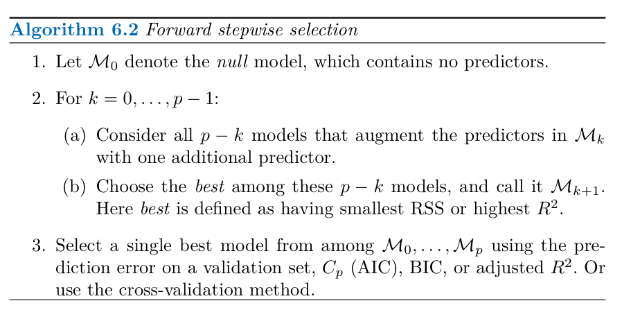
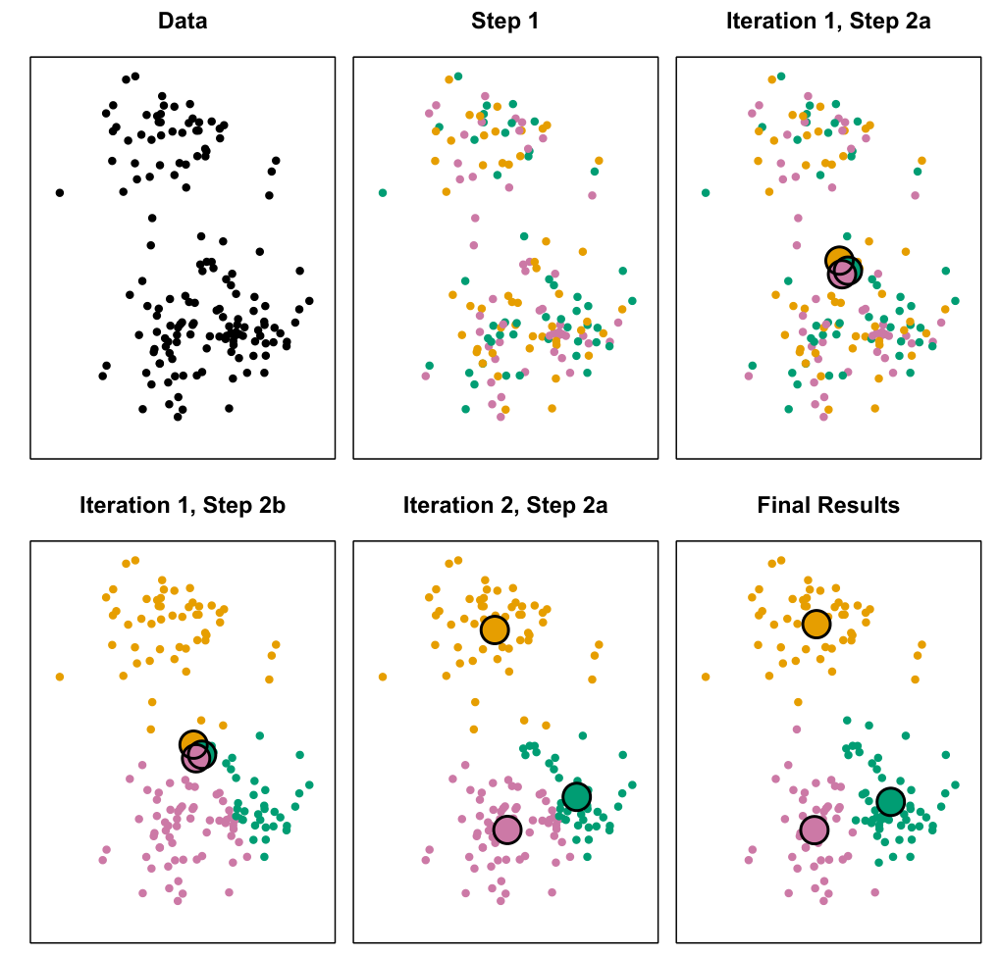

```{r setup, include=FALSE}
knitr::opts_chunk$set(echo = TRUE)
```

# What Is Statistical Learning?


Suppose that we observe a quantitative response $Y$ and $p$
different predictors, $X_1, X_2, \cdots , X_p$. We assume that there is some
relationship between $Y$ and $X = (X_1, X_2, \cdots , X_p)$, which can be written
in the very general form $Y = f(X) + \epsilon$.

Here $f$ is some fixed but unknown function of $X_1, . . . , X_p$, and $\epsilon$ is a random
error term, which is independent of $X$ and has mean zero. In this formulation, $f$ represents the systematic information that $X$ provides about $Y$.

Consider a given estimate $\hat{f}$ and a set of predictors $X$, which yields the
prediction $\hat{Y} = \hat{f}(X)$. Assume for a moment that both $\hat{f}$ and $X$ are fixed,
so that the only variability comes from $\epsilon$. Then, it is easy to show that

$$\begin{aligned}
E(Y-\hat{Y} )^2 = E\left(f(X) + \epsilon - \hat{f}(X) \right)^2 &=\left(f(X) - \hat{f}(X) \right)^2+\text{Var}(\epsilon) \\
&= \underbrace{[f(X) - \hat{f}(X)]^2}_{\text{Reducible}} + \underbrace{\text{Var}(\epsilon)}_{\text{Irreducible}} 
\end{aligned}
$$

where $E(Y - \hat{Y} )^2$ represents the average, or expected value, of the squared expected
value difference between the predicted and actual value of $Y$ , and $\text{Var}(\epsilon)$ 
  represents the variance associated with the error term $\epsilon$.
The focus  is on techniques for estimating $f$ with the aim of
minimizing the reducible error. It is important to keep in mind that the
irreducible error will always provide an upper bound on the accuracy of
our prediction for $Y$ . This bound is almost always unknown in practice.


## The Trade-Off Between Prediction Accuracy and Model Interpretability

One might reasonably ask the following question: why would we ever
choose to use a more restrictive method instead of a very flexible approach?

* If we are mainly interested in inference, then restrictive models are much
more interpretable.


<center>

{width=100%, height=120%}
 <figcaption>A representation of the tradeoff between flexibility and inter-
pretability, using different statistical learning methods. In general, as the flexibility
of a method increases, its interpretability decreases.</figcaption>  
</center>


## The Bias-Variance Trade-Off


<center>
{width=100%, height=120%}
 <figcaption>Left: Data simulated from f, shown in black. Three estimates of
f are shown: the linear regression line (orange curve), and two smoothing spline
fits (blue and green curves). Right: Training MSE (grey curve), test MSE (red
curve), and minimum possible test MSE over all methods (dashed line). Squares
represent the training and test MSEs for the three fits shown in the left-hand
panel.</figcaption>  
</center>


$$E(Y_0 - \hat{f}(X_0))^2 = Var( \hat{f}(X_0)) + \left(\text{Bias}\left( \hat{f}(X_0)\right)\right)^2 + Var(\epsilon).$$

$$\text{Bias}\left( \hat{f}(X_0)\right) = E(\hat{f}(X_0)) - f(X_0)$$

Here the notation 
$E(Y_0 - \hat{f}(X_0))^2$
defines the expected test MSE at $x_0$, expected
test $MSE$
and refers to the average test $MSE$ that we would obtain if we repeatedly
estimated $f$ using a large number of training sets, and tested each at $X_0$. The
overall expected test MSE can be computed by averaging 
$E(Y_0 - \hat{f}(X_0))^2$
over all possible values of $x_0$ in the test set.

The equation tells us that in order to minimize the expected test error,
we need to select a statistical learning method that simultaneously achieves
low variance and low bias. 


What do we mean by the variance and bias of a statistical learning
method? Variance refers to the amount by which $\hat{f}$ would change if we
estimated it using a different training data set. Since the training data
are used to fit the statistical learning method, different training data sets
will result in a different $\hat{f}$. But ideally the estimate for $f$ should not vary
too much between training sets. However, if a method has high variance
then small changes in the training data can result in large changes in $\hat{f}$. In general, more flexible statistical methods exhibit higher variance and lower bias.


<center>
{width=100%, height=120%}
 <figcaption>Squared bias (blue curve), variance (orange curve), Var($\epsilon$)
(dashed line), and test MSE (red curve) for the three data sets in Figures 2.9–2.11.
The vertical dotted line indicates the flexibility level corresponding to the smallest
test MSE.</figcaption>  
</center>


As a general rule, as we use more flexible methods, the variance will
increase and the bias will decrease. The relative rate of change of these
two quantities determines whether the test MSE increases or decreases. As
we increase the flexibility of a class of methods, the bias tends to initially
decrease faster than the variance increases. Consequently, the expected
test MSE declines. However, at some point increasing flexibility has little
impact on the bias but starts to significantly increase the variance. When
this happens the test MSE increases.


The relationship between bias, variance, and mean squared error ($\text{MSE}$) is known as the bias-variance trade-off. Finding a balance between low variance and low squared bias is crucial for optimal model performance. In practical terms, when the true function is unknown, we cannot calculate test $\text{MSE}$, bias, or variance directly, but it's essential to consider the bias-variance trade-off.


As model flexibility increases, the reasons for the decrease in bias and the increase in variance can be attributed to several key factors:

Definition of Bias and Variance:

* Bias refers to the error introduced by overly simplistic assumptions in the model. Less flexible models typically respond simply to the data and have specific assumptions that may overlook complex and nonlinear relationships.

* Variance indicates how much the model's predictions fluctuate in response to minor changes in the training dataset. More flexible models tend to be more sensitive to the data and may react strongly to small changes in the training data.


Decrease in Bias:

* When using a more flexible model (such as decision trees or neural networks), these models can better capture complex and nonlinear patterns in the data. Consequently, they achieve better alignment with the actual data and exhibit lower bias compared to simpler models like linear regression.

Increase in Variance:

* Conversely, flexible models often become closely fitted to the training data, leading to greater variability between training data and new data. This means that if a model "overfits" the training data, its predictive power on new and out-of-sample data may decrease, resulting in higher variance.
Thus, as flexibility increases, while the model can respond to the complexities of relationships and show lower bias, there is also the risk of increased variability, which can lead to poor performance on new data. This relationship between bias and variance forms the basis of the bias-variance trade-off, a key concept in machine learning and statistics.

## Singular-Value Decomposition (SVD)

Given the $N \times p$ data matrix $X$, let

\begin{eqnarray}
X_{N\times p} &=& U_{N\times N}D_{N\times N}V^T_{N\times p} \\
  &=& RV^T
\end{eqnarray}

be the singular-value decomposition (SVD) of $X$; that is, $V$ is $p \times N$ with
orthonormal columns($V^TV=I_N$), with columns $v_j$ called the right singular vectors, $U$ is $N \times N$ orthogonal($U^TU=UU^T=I_N$) whose columns $u_j$ are
called the left singular vectors, and $D$ a diagonal matrix
with elements $d_1 \geq d_2 \geq \cdots \geq d_N \geq 0$  known as the singular values. The matrix $R=UD$ is $N \times N$, with rows $r_i^T$. 
The columns of $R=UD$ are called the principal components of $X$.

The $N \times N$ gram (inner-product) matrix is
$$K = XX^T=UD^2V^T.$$

- $U$:  an $N \times N$ matrix of the orthonormal eigenvectors of $XX^T$ 

- $V$:  an $N \times N$ matrix containing the orthonormal eigenvectors of $X^TX$

- $D$: a diagonal matrix with $p$ elements equal to the root of the positive eigenvalues of $XX^T$ or $X^TX$ (both matrics have the same positive eigenvalues anyway).


#### Examples

\begin{eqnarray}
X=\begin{bmatrix}
3 & 2 & 2 \\
2 & 3 & -2
\end{bmatrix}
\end{eqnarray}

- To calculate the SVD, First, we need to compute the singular values by finding eigenvalues of $XX^T$(to calculate $U$)


\begin{eqnarray}
K=XX^T =\begin{bmatrix}
3 & 2 & 2 \\
2 & 3 & -2
\end{bmatrix} \times 
\begin{bmatrix}
3 & 2 \\
2 & 3 \\
2 & -2 
\end{bmatrix}
=\begin{bmatrix}
17 & 8 \\
8 & 17 
\end{bmatrix}
\end{eqnarray}

- The characteristic equation for the above matrix is:

\begin{eqnarray}
XX^T-\lambda I &=&0 \\
\lambda^2 -34\lambda +225&=&0 \\ 
(\lambda -25)(\lambda -9)&=&0
\end{eqnarray}
 
- So our singular values are:
$\sqrt{\lambda_1}=5,\sqrt{\lambda_2}=3$

- Now we find the right singular vectors i.e orthonormal set of eigenvectors of $X^TX$. The eigenvalues of $X^TX$ are 25, 9, and 0, and since $X^TX$ is symmetric we know that the eigenvectors will be orthogonal.

- For $\lambda=25$

\begin{eqnarray}
XX^T -25I =\begin{bmatrix}
-12 & 12 & 2 \\
12 & -12 & -2 \\
2 & -2 & -17
\end{bmatrix} 
\end{eqnarray}

- which can be row-reduces to:

\begin{eqnarray}
\begin{bmatrix}
1 & -1 & 0 \\
0 & 0 & 1 \\
0 & 0 & 0
\end{bmatrix} 
\end{eqnarray}

- A unit vector in the direction of it is:

\begin{eqnarray}
\begin{bmatrix}
\frac{1}{\sqrt{2}}  \\
\frac{1}{\sqrt{2}}  \\
0 
\end{bmatrix} 
\end{eqnarray}

- Similarly, for $\lambda = 9$, the eigenvector is:

\begin{eqnarray}
\begin{bmatrix}
\frac{1}{\sqrt{18}}  \\
-\frac{1}{\sqrt{18}}  \\
\frac{4}{\sqrt{18}}
\end{bmatrix} 
\end{eqnarray}

- For the $3$rd eigenvector, 
we could use the property that it
is perpendicular to $v_1$ and $v_2$ such that:

\begin{eqnarray}
v_1^Tv_3 &=&0 \\
v_2^Tv_3 &=&0
\end{eqnarray}

\begin{eqnarray}
v_3=
\begin{bmatrix}
a  \\
b  \\
c
\end{bmatrix}
=
\begin{bmatrix}
a  \\
-a  \\
-\frac{a}{2}
\end{bmatrix}
=
\begin{bmatrix}
\frac{2}{3}  \\
-\frac{2}{3} \\
-\frac{1}{3}
\end{bmatrix}
\end{eqnarray}

Now, we calculate $U$ using the formula 
$u_i = \frac{1}{\sqrt{\lambda}} X v_i$ and this gives 


\begin{eqnarray}
U = 
\begin{bmatrix}
\frac{1}{\sqrt{2}} & \frac{1}{\sqrt{2}}  \\
\frac{1}{\sqrt{2}} &-\frac{1}{\sqrt{18}}   \\
\end{bmatrix} 
\end{eqnarray}
- Hence, our final SVD equation becomes:
\begin{eqnarray}
X =   
\begin{bmatrix}  
\frac{1}{\sqrt{2}} & \frac{1}{\sqrt{18}} & \frac{2}{3} \\
\frac{1}{\sqrt{2}} & -\frac{1}{\sqrt{18}} & -\frac{2}{3} \\
0 & \frac{4}{\sqrt{18}} & -\frac{1}{3}  
\end{bmatrix}  
\begin{bmatrix}  
5 & 0 & 0 \\
0 & 3 & 0 \\
0 & 0 & 0  
\end{bmatrix}  
\begin{bmatrix}  
\frac{1}{\sqrt{2}} & \frac{1}{\sqrt{2}} & 0 \\
\frac{1}{\sqrt{18}} & -\frac{1}{\sqrt{18}} & \frac{4}{\sqrt{18}}  
\end{bmatrix}
\end{eqnarray}


Principal components can be computed using inner-product kernels as
well; since this is frequently useful, we give some details. Suppose first
that we have a centered data matrix $X$, and let $X = UDV^T$ be its SVD. Then $Z = UD$ is the matrix of principal component variables. But if $K = XX^T$ , then it follows that $K = UD^2U^T$ , and
hence we can compute $Z$ from the eigen decomposition of $K$. If $X$ is not
centered, then we can center it using $\tilde{X}= (I - M)X$, where $M =\frac{1}{N} 11^T$
is the mean operator. Thus we compute the eigenvectors of the double-centered kernel 
$$(I - M)K(I - M)$$
for the principal components from an
uncentered inner-product matrix. 


## Curse of dimensionality

The curse of dimensionality refers to various phenomena that arise when analyzing and organizing data in high-dimensional spaces that do not occur in low-dimensional settings such as the three-dimensional physical space of everyday experience.

### Risks of Overfitting due to Sparsity

We are so used to living in three dimensions that our intuition fails us
when we try to imagine a high-dimensional space. Even a basic 4D
hypercube is incredibly hard to picture in our minds, let
alone a 200-dimensional ellipsoid bent in a 1,000-dimensional space.


<center>

{width=50%, height=50%}
<figcaption>Point, segment, square, cube, and tesseract ($0$D to $4$D hypercubes).</figcaption>  
</center>

It turns out that many things behave very differently in high-dimensional
space. For example, if you pick a random point in a unit square (a $1 \times 1$
square), it will have only about a $0.4\%$ chance ($1-(1-2\times a)^2=1-0.996004=0.003996$) of being located less than
$0.001$ from a border (in other words, it is very unlikely that a random point
will be “extreme” along any dimension) But in a 10,000-dimensional unit
hypercube (a $1 \times 1 \times \cdots \times 1$ cube, with ten thousand 1s), this probability is greater than $99.999999\%$. 
Most points in a high-dimensional hypercube are very close to the border.


```{r}
sprintf('%0.15f',1-(1-2*.001)^10000)
```

<center>

{width=50%, height=50%}
</center>


Here is a more troublesome difference: if you pick two points randomly in a
unit square, the distance between these two points will be, on average,
roughly 0.52. If you pick two random points in a 3D unit cube, the average
distance will be roughly 0.66. But what about two points picked randomly in
a 1,000,000-dimensional unit hypercube? The average distance, believe it or
not, will be about 408.25 (roughly 1,000,0006)! This is counterintuitive: how
can two points be so far apart when they both lie within the same unit
hypercube? Well, there’s just plenty of space in high dimensions. As a result,
high-dimensional datasets are at risk of being very sparse: most training
instances are likely to be far away from each other. This also means that a
new instance will likely be far away from any training instance, making
predictions much less reliable than in lower dimensions, since they will be
based on much larger extrapolations. In short, the more dimensions the
training set has, the greater the risk of overfitting it.
In theory, one solution to the curse of dimensionality could be to increase the
size of the training set to reach a sufficient density of training instances.
Unfortunately, in practice, the number of training instances required to reach
a given density grows exponentially with the number of dimensions.

### Regression with Least Squares in High-Dimensional Data


The Issue in the Case of  $p\geq n$
When the number of features 
$p$ is equal to or greater than the number of observations $n$, the matrix 
$X^TX$ behaves as follows:

* $X$ is an $n \times(p+1)$
 matrix (including a column of ones for $\beta_0$). 

$p\geq n$, the number of rows is equal to or less than the number of columns.

This means:

* Non-invertibility of  $X^TX$: In the case of $p\geq n$
, the matrix $X^TX$ is not invertible, which implies that we cannot compute the coefficients $\beta$
using the standard formula.

* Perfect Fit and Overfitting: Even if an inverse were to exist (which is rare in high dimensional cases), regression with a large number of features means we can find a model with arbitrary coefficients that results in zero residuals, effectively fitting all training data perfectly. This indicates overfitting, where the model captures noise rather than the true underlying relationship.


An example is shown in Figure 6.22 with $p = 1$ feature (plus an intercept)
in two cases: when there are $20$ observations, and when there are only
two observations.

<center>

{width=50%, height=50%}
<figcaption>Figure 6.22: Left: Least squares regression in the low-dimensional setting.
Right: Least squares regression with n = 2 observations and two parameters to be
estimated (an intercept and a coefficient).</figcaption>  
</center>


Figure 6.23 further illustrates the risk of carelessly applying least squares
when the number of features p is large. Data were simulated with n = 20
observations, and regression was performed with between 1 and 20 features,


<center>

{width=50%, height=50%}
<figcaption>Figure 6.23: On a simulated example with n = 20 training observations,
features that are completely unrelated to the outcome are added to the model.
Left: The R2 increases to 1 as more features are included. Center: The training
set MSE decreases to 0 as more features are included. Right: The test set MSE
increases as more features are included.</figcaption>  
</center>


each of which was completely unrelated to the response. As shown in the
figure, the model R2 increases to 1 as the number of features included in the
model increases, and correspondingly the training set MSE decreases to 0
as the number of features increases, even though the features are completely
unrelated to the response. On the other hand, the MSE on an independent
test set becomes extremely large as the number of features included in the
model increases, because including the additional predictors leads to a vast
increase in the variance of the coefficient estimates. Looking at the test
set MSE, it is clear that the best model contains at most a few variables.
However, someone who carelessly examines only the $R^2$ or the training set
MSE might erroneously conclude that the model with the greatest number
of variables is best. This indicates the importance of applying extra care
when analyzing data sets with a large number of variables, and of always
evaluating model performance on an independent test set.


### $\hat{\sigma^2}=0$

Unfortunately, the $C_p$, $AIC$, and $BIC$ approaches
are not appropriate in the high-dimensional setting, because estimating $\hat{\sigma^2}$
is problematic. 

### Multicollinearity and Interpreting Results in High Dimensions


When we perform the lasso, ridge regression, or other regression procedures in the high-dimensional setting, we must be quite cautious in the way
that we report the results obtained. In the high-dimensional setting, the multicollinearity
problem is extreme: any variable in the model can be written as a linear
combination of all of the other variables in the model. Essentially, this
means that we can never know exactly which variables (if any) truly are
predictive of the outcome, and we can never identify the best coefficients
for use in the regression. At most, we can hope to assign large regression
coefficients to variables that are correlated with the variables that truly are
predictive of the outcome.


# Linear Regression

## R-squared

$$\begin{aligned}
R^2=\frac{SSR}{SST}=1-\frac{SSE}{SST}
=1-\frac{\sum \left(y_i-\hat{y_i}\right)^2}{\sum \left(y_i-\bar{y}\right)^2}
=1-\frac{\sum e_i^2}{\sum \left(y_i-\bar{y}\right)^2}
=1-\frac{\text{Unexplained Variation}}{\text{Total variation}}
\end{aligned}.$$

## Adjusted R-squared: 


$$\begin{aligned}
\bar{R}^2=\frac{MSR}{MST}=1-\frac{\frac{SSE}{df_{sse}}}{\frac{SST}{df_{sse}}}
= =1-\frac{\frac{\sum \left(y_i-\hat{y_i}\right)^2}{(n-p)}}{\frac{\sum \left(y_i-\bar{y}\right)^2}{n-1}},
\end{aligned}$$

Where $p=K+1$ and $K$ is the number of independent regressors.


## ANOVA

$$
\begin{array}{ccccccc}
\hline
\text{Source of Variation} & \text{SS} & \text{df} & \text{MS} & F  & \text{Rejection Region} & \text{P-value}  \\
\hline
\text{Regression} & \text{SSR}=\sum \left(\hat{y}_i-\bar{y}\right)^2 & \text{df}=p-1 & \text{MSR} &  F^{*}=\frac{MSR}{MSE} &
F^* > F_{(\alpha,p,n-p)} & P(F_{(\alpha,p,n-p)} \geq F^*)
\\ \text{Residual error} & \text{SSE}=\sum \left(y_i-\hat{y_i}\right)^2 & \text{df}=n-p & \text{MSE} &   & &
\\ \text{Total} & \text{SST}=\sum \left(y_i-\bar{y}\right)^2 & \text{df}=n-1 &  &   & &
\end{array}$$


<center>
{width=50%, height=50%}
</center>

$E(MSE)=\sigma^2$ 

$E(MSR)=\sigma^2 +\beta_1^2 \sum (x_i-\bar{x})^2$

Note that when $\beta_1 = 0$, then $E(MSR) = E(MSE)$, otherwise $E(MSR) > E(MSE)$. A second way
of testing whether $\beta_1 = 0$ is by the F-test:

$$\begin{array}{ccc}
H0 : \beta_1 = 0 \text{ and } HA : \beta_1 \neq 0 \text{ and } \text{Test
Statistic:} F^{*}=\frac{MSR}{MSE}   \text{ and } \text{Rejection Region:} F^* > F_{(\alpha,p,n-p)} & \text{P-value:}P(F_{(\alpha,p,n-p)} \geq F^*)
\end{array}$$

## AIC

Let p be the number of estimated parameters in the model. Let 
$\hat{L}$ be the maximized value of the likelihood function for the model. Then the AIC 
value of the model is the following:


$$\mathrm{AIC} = 2p-2\ln\left(\hat{L}\right)$$


## BIC

The Bayesian information criterion (BIC): defined as:


$$\mathrm{BIC} = p \log n-2\ln\left(\hat{L}\right)$$

<center>
{width=50%, height=50%}
</center>


## Omnibus/Prob(Omnibus)

This function tests the null hypothesis that a sample comes from a normal distribution. It is based on D’Agostino and Pearson’s  test that combines skew and kurtosis to produce an omnibus test of normality.

### statistic

$s^2 + k^2$, where s is the z-score returned by skewtest and k is the z-score returned by kurtosistest.

### pvalue

A 2-sided chi squared probability for the hypothesis test.


### Durbin-Watson

Durbin-Watson tests for homoscedasticity. We hope to have a value between 1 and 2. In statistics, the Durbin–Watson statistic is a test statistic used to detect the presence of autocorrelation at lag 1 in the residuals (prediction errors) from a regression analysis. 

The null hypothesis of the test is that there is no serial correlation in the residuals. The Durbin-Watson test statistic is defined as:

$\frac{\sum \left( e_t - e_{t-1}\right)^2}{\sum e_i^2}$

The test statistic is approximately equal to $2\times(1-r)$ where $r$ is the sample autocorrelation of the residuals. Thus, for $r == 0$, indicating no serial correlation, the test statistic equals $2$. This statistic will always be between 0 and 4. The closer to 0 the statistic, the more evidence for positive serial correlation. The closer to 4, the more evidence for negative serial correlation.


<center>
{width=50%, height=50%}
</center>


### Jarque-Bera (JB)/Prob(JB) The Jarque-Bera test of normality.

Jarque-Bera (JB)/Prob(JB) – like the Omnibus test in that it tests both skew and kurtosis. We hope to see in this test a confirmation of the Omnibus test. In this case we do. 

Each output returned has 1 dimension fewer than data

The Jarque-Bera test statistic tests the null that the data is normally distributed against an alternative that the data follow some other distribution. The test statistic is based on two moments of the data, the skewness, and the kurtosis, and has an asymptotic  distribution.

The test statistic is defined

$$n\left(\frac{s^2}{6}+\frac{(k-3)^2}{24}\right)$$

where n is the number of data points, S is the sample skewness, and K is the sample kurtosis of the data.


### Condition Number

This test measures the sensitivity of a function's output as compared to its input. When we have multicollinearity
, we can expect much higher fluctuations to small changes in the data, hence, we hope to see a relatively small number, something below 30. In this case we are well below 30, which we would expect given our model only has two variables and one is a constant. One way to assess multicollinearity is to compute the condition number. Values over 20 are worrisome (see Greene 4.9). The first step is to normalize the independent variables to have unit length. Then, we take the square root of the ratio of the biggest to the smallest eigen values.


The condition number (abbreviated “Cond. No.” in the summary) is a measure of “how close to singular” a matrix is; the higher, the “more singular” (and infinite means singular — i.e. noninvertible), and the more “error” a best fit approximation is. A condition number of $2.03 \times 10^{17}$ is “practically” infinite, numerically. In truth, it should be infinity.
Warning 2 states that the smallest eigenvalue (of the moment matrix) is $1.02 \times 10^{-21}$, which is “practically” 0. An eigenvalue of $X^T X$ being 0 means the determinant $det(X^T X) = 0$, and so $X^T X$ is not invertible.

The condition number measures how numerically stable the matrix is. A large condition number indicates that the matrix is ill-conditioned. This means that it is sensitive to small changes in its elements and can lead to large changes in the solution when solving linear systems.

### OLSResults.condition_number

Return condition number of exogenous matrix.

Calculated as ratio of largest to smallest singular value of the exogenous variables. This value is the same as the square root of the ratio of the largest to smallest eigenvalue of the inner-product of the exogenous variables.


# Linear Model Selection and Regularization

There are many alternatives, both classical and modern, to using least
squares to fit. We discuss three important classes of
methods.

• Subset Selection. This approach involves identifying a subset of the p
predictors that we believe to be related to the response. We then fit
a model using least squares on the reduced set of variables.

• Shrinkage. This approach involves fitting a model involving all p pre-
dictors. However, the estimated coefficients are shrunken towards zero
relative to the least squares estimates. This shrinkage (also known as
regularization) has the effect of reducing variance. Depending on what
type of shrinkage is performed, some of the coefficients may be esti-
mated to be exactly zero. Hence, shrinkage methods can also perform
variable selection.

• Dimension Reduction. This approach involves projecting the p predic-
tors into an M-dimensional subspace, where M < p. This is achieved
by computing M different linear combinations, or projections, of the
variables. Then these M projections are used as predictors to fit a
linear regression model by least squares.


## Subset Selection

## Best Subset Selection

To perform best subset selection, we fit a separate least squares regression best subset
selection
for each possible combination of the p predictors. That is, we fit all p models
that contain exactly one predictor, all $\binom{p}{2}=\frac{p(p-1)}{2}$
 models that contain
exactly two predictors, and so forth. We then look at all of the resulting
models, with the goal of identifying the one that is best.


<center>
{width=50%, height=50%}
</center>

While best subset selection is a simple and conceptually appealing approach, it suffers from computational limitations. The number of possible
models that must be considered grows rapidly as $p$ increases. In general,
there are $2^pp$ models that involve subsets of p predictors. So if $p = 10$,
then there are approximately $1,000$ possible models to be considered, and if
$p = 20$, then there are over one million possibilities!


## Stepwise Selection

For computational reasons, best subset selection cannot be applied with
very large $p$. Best subset selection may also suffer from statistical problems
when $p$ is large. The larger the search space, the higher the chance of finding
models that look good on the training data, even though they might not
have any predictive power on future data. Thus an enormous search space
can lead to overfitting and high variance of the coefficient estimates.
For both of these reasons, stepwise methods, which explore a far more
restricted set of models, are attractive alternatives to best subset selection.


### Forward Stepwise Selection

Forward stepwise selection is a computationally efficient alternative to best 
subset selection. While the best subset selection procedure considers all
$2^p$ possible models containing subsets of the p predictors, forward step-
wise considers a much smaller set of models. Forward stepwise selection
begins with a model containing no predictors, and then adds predictors
to the model, one-at-a-time, until all of the predictors are in the model.
In particular, at each step the variable that gives the greatest additional
improvement to the fit is added to the model.

Unlike best subset selection, which involved fitting $2^p$ models, forward
stepwise selection involves fitting one null model, along with $p - k$ models
in the $k$th iteration, for $k = 0, \cdots , p - 1$. This amounts to a total of 
$$1 + \sum_{k=0}^{p-1} (p-k)=1+\frac{p(p+1)}{2}$$
models. This is a substantial difference: when
$p = 20$, best subset selection requires fitting $1,048,576$ models, whereas
forward stepwise selection requires fitting only $211$ models.


<center>

{width=50%, height=50%}

</center>

### Backward Stepwise Selection


Like forward stepwise selection, backward stepwise selection provides an
efficient alternative to best subset selection. However, unlike forward step-wise selection, it begins with the full least squares model containing all $p$
predictors, and then iteratively removes the least useful predictor, one-at-a-time.


<center>

{width=50%, height=50%}

</center>

Like forward stepwise selection, the backward selection approach searches
through only $1+p(p+1)/2$ models, and so can be applied in settings where
$p$ is too large to apply best subset selection. Also like forward stepwise
selection, backward stepwise selection is not guaranteed to yield the best
model containing a subset of the p predictors.


Backward selection requires that the number of samples $n$ is larger than
the number of variables $p$ (so that the full model can be fit). In contrast,
forward stepwise can be used even when $n < p$, and so is the only viable
subset method when $p$ is very large.


### Hybrid Approaches

The best subset, forward stepwise, and backward stepwise selection approaches generally give similar but not identical models. As another alternative, hybrid versions of forward and backward stepwise selection are
available, in which variables are added to the model sequentially, in analogy
to forward selection. However, after adding each new variable, the method
may also remove any variables that no longer provide an improvement in
the model fit. Such an approach attempts to more closely mimic best subset selection while retaining the computational advantages of forward and
backward stepwise selection.


## Choosing the Optimal Model

To apply best subset selection, forward selection, and backward selection methods, we need a way to determine which of these models is best. 


The training error can be a poor estimate of the test error.
Therefore, $RSS$ and $R^2$ are not suitable for selecting the best model among
a collection of models with different numbers of predictors.
In order to select the best model with respect to test error, we need to
estimate this test error. There are two common approaches:

1. We can indirectly estimate test error by making an adjustment to the
training error to account for the bias due to overfitting.

2. We can directly estimate the test error, using either a validation set
approach or a cross-validation approach

### $C_p$, AIC, BIC, and Adjusted $R^2$


For a fitted least squares model containing d predictors, the $C_p$ estimate
of test MSE is computed using the equation
$$C_p = \frac{1}{n}\left(\text{RSS} + 2d \hat{\sigma}^2\right)$$
where $\hat{\sigma}^2$ is an estimate of the variance of the error $\epsilon$ associated with each
response measurement

### Validation and Cross-Validation

In the past, performing cross-validation was computationally prohibitive
for many problems with large $p$ and/or large $n$, and so AIC, BIC, $C_p$,
and adjusted $R^22$ were more attractive approaches for choosing among a
set of models. However, nowadays with fast computers, the computations
required to perform cross-validation are hardly ever an issue. Thus, cross-
validation is a very attractive approach for selecting from among a number
of models under consideration.

## Shrinkage Methods

The subset selection methods described involve using least
squares to fit a linear model that contains a subset of the predictors. As an
alternative, we can fit a model containing all $p$ predictors using a technique
that constrains or regularizes the coefficient estimates, or equivalently, that
shrinks the coefficient estimates towards zero. It may not be immediately
obvious why such a constraint should improve the fit, but it turns out that
shrinking the coefficient estimates can significantly reduce their variance.
The two best-known techniques for shrinking the regression coefficients
towards zero are ridge regression and the lasso.

## Ridge Regression


The least squares fitting procedure estimates
$\beta_0, \beta_1, \cdots , \beta_p$ using the values that minimize
$$RSS = \sum_{i=1}^{n} (y_i - \hat{y}_i)^2 =\sum_{i=1}^{n} \left(y_i - \beta_0 -\sum_{j=1}^{p} \beta_j x_{ij}\right)^2$$


Ridge regression is very similar to least squares, except that the coefficients ridge
regression are estimated by minimizing a slightly different quantity.

The
ridge regression coefficient estimates $\hat{\beta}^{Ridge}$ are the values that minimize

$$ \sum_{i=1}^{n} \left(y_i - \beta_0 -\sum_{j=1}^{p} \beta_j x_{ij}\right)^2 +\lambda \sum_{j=1}^{p} \beta_j^2 =\text{RSS} + \lambda \sum_{j=1}^{p} \beta_j^2$$


where $\lambda \geq 0$ is a tuning parameter, to be determined separately. 
The second term, 
$$\lambda \sum_{j=1}^{p} \beta_j^2$$
, called a shrinkage penalty, is shrinkage
penalty 
small when $\beta_0, \beta_1, \cdots , \beta_p$ are close to zero, and so it has the effect of shrinking
the estimates of $\beta_j$ towards zero. The tuning parameter $\lambda$ serves to control
the relative impact of these two terms on the regression coefficient estimates.
When $\lambda=0$, the penalty term has no effect, and ridge regression
will produce the least squares estimates. However, as $\lambda \to +\infty$, the impact of
the shrinkage penalty grows, and the ridge regression coefficient estimates
will approach zero.

Ridge regression’s advantage over least squares is rooted in the bias-variance
trade-off. As $\lambda$ increases, the flexibility of the ridge regression fit decreases,
leading to decreased variance but increased bias. 

## The Lasso

Ridge regression does have one obvious disadvantage. Unlike best subset,
forward stepwise, and backward stepwise selection, which will generally
select models that involve just a subset of the variables, ridge regression
will include all p predictors in the final model. The penalty $\lambda \sum_{j=1}^{p} \beta_j^2$
will shrink all of the coefficients towards zero, but it will not set any of them
exactly to zero (unless $\lambda = +\infty$). This may not be a problem for prediction
accuracy, but it can create a challenge in model interpretation in settings in
which the number of variables p is quite large.

The
Lasso regression coefficient estimates $\hat{\beta}^{Lasso}$ are the values that minimize

$$ \sum_{i=1}^{n} \left(y_i - \beta_0 -\sum_{j=1}^{p} \beta_j x_{ij}\right)^2 +\lambda \sum_{j=1}^{p} \beta_j^2 =\text{RSS} + \lambda \sum_{j=1}^{p} |\beta_j|$$
where $\lambda \geq 0$ is a tuning parameter.


## Another Formulation for Ridge Regression and the Lasso

One can show that the lasso and ridge regression coefficient estimates solve
the problems

$$\underset{\beta}{\text{minimize}}\sum_{i=1}^{n} \left(y_i - \beta_0 -\sum_{j=1}^{p} \beta_j x_{ij}\right)^2 \quad \text{subject to } \quad \lambda \sum_{j=1}^{p} \beta_j^2 \leq s$$

and


$$\underset{\beta}{\text{minimize}}\sum_{i=1}^{n} \left(y_i - \beta_0 -\sum_{j=1}^{p} \beta_j x_{ij}\right)^2 \quad \text{subject to } \quad \lambda \sum_{j=1}^{p} |\beta_j| \leq s$$


respectively.

<center>

{width=50%, height=50%}
<figcaption>Contours of the error and constraint functions for the lasso
(left) and ridge regression (right). The solid blue areas are the constraint regions,
$|\beta_1|+|\beta_2| \leq s$ and $\beta_1^2+\beta_2^2 \leq s$, while the red ellipses are the contours of the RSS.
.</figcaption>  
</center>

## Dimension Reduction Methods

The methods that we have discussed so far in this chapter have controlled
variance in two different ways, either by using a subset of the original variables, or by shrinking their coefficients toward zero. All of these methods
are defined using the original predictors, $X_1, X_2, \cdots , X_p$. We now explore
a class of approaches that transform the predictors and then fit a least
squares model using the transformed variables. We will refer to these techniques as dimension reduction methods.

### Principal Components Regression

#### The Principal Components Regression Approach

The principal components regression (PCR) approach involves constructing the first $M$ principal components, 
$Z_1, . . . , Z_M$, and then using these
components as the predictors in a linear regression model that is fit using least squares. The key idea is that often a small number of principal
components suffice to explain most of the variability in the data, as well
as the relationship with the response. In other words, we assume that the
directions in which $X_1, \cdots , X_p$ show the most variation are the directions
that are associated with Y. While this assumption is not guaranteed to be
true, it often turns out to be a reasonable enough approximation to give
good results.

Let $Z_1, \cdots , Z_M$ represent $M < p$ linear combinations of our original
linear combination $p$ predictors. That is,
$$Z_m = \sum_{j=1}^{p} \phi_{jm} X_j$$

for some constants 
$$\phi_{1m},\cdots , \phi_{pm} \quad \quad m=1, \cdots , M$$
We can then fit the
linear regression model

$$Y_i = \beta_0 + \sum_{j=1}^{M} \beta_j Z_{im} + \epsilon_i$$

using least squares.


### Partial Least Squares

The PCR approach that we just described involves identifying linear combinations, 
or directions, that best represent the predictors 
$X_1, . . . , X_p$. These
directions are identified in an unsupervised way, since the response $Y$ is
not used to help determine the principal component directions. That is,
the response does not supervise the identification of the principal components. Consequently, PCR suffers from a drawback: there is no guarantee
that the directions that best explain the predictors will also be the best
directions to use for predicting the response.

We now present partial least squares (PLS), a supervised alternative to 
PCR. Like PCR, PLS is a dimension reduction method, which first identifies
a new set of features $Z_1, \cdots , Z_M$ that are linear combinations of the original
features, and then fits a linear model via least squares using these M new
features. But unlike PCR, PLS identifies these new features in a supervised
way—that is, it makes use of the response Y in order to identify new
features that not only approximate the old features well, but also that are
related to the response. Roughly speaking, the PLS approach attempts to
find directions that help explain both the response and the predictors.

We now describe how the first PLS direction is computed. After standardizing the $p$ predictors, PLS computes the first direction $Z_1$ by setting
each $\phi_{j1}$ in 

$$Z_m = \sum_{j=1}^{p} \phi_{jm} X_j$$

equal to the coefficient from the simple linear regression
of $Y$ onto $X_j$. One can show that this coefficient is proportional to the correlation between 
$Y$ and $X_j$. Hence, in computing $Z_1 = \sum_{j=1}^{p} \phi_{j1} X_j$, PLS
places the highest weight on the variables that are most strongly related to
the response.

To identify the second PLS direction we first adjust each of the variables
for $Z_1$, by regressing each variable on $Z_1$ and taking residuals. These residuals can be interpreted as the remaining information that has not been
explained by the first PLS direction. We then compute $Z_2$ using this orhogonalized data in exactly the same fashion as $Z_1$ was computed based
on the original data. This iterative approach can be repeated $M$ times to
identify multiple PLS components $Z_1, \cdots , Z_M$. Finally, at the end of this
procedure, we use least squares to fit a linear model to predict $Y$ using
$Z_1, \cdots , Z_M$ in exactly the same fashion as for PCR.

This means identifying the second PLS direction:

* First, we regress each of the predictor variables (X) on $Z_1$ and obtain the residuals. These residuals represent the information that has not been explained by $Z_1$.

* Then, $Z_2$ is computed using this new data (the residuals) in the same way that $Z_1$ was calculated. This allows us to identify new features that provide information independently of $Z_1$.


As with PCR, the number $M$ of partial least squares directions used in
PLS is a tuning parameter that is typically chosen by cross-validation. We
generally standardize the predictors and response before performing PLS.


# Classification


Accuracy: This metric shows us to what extent the predicted data by our model matches the actual data. 

Precision: This metric shows us how much of the data that our model classified as positive are actually positive. 

Recall: This metric indicates the proportion of the actual positive data that our model classified as positive. In other words, this metric shows how sensitive our model is to positive data.

Specificity: This metric indicates the proportion of the actual negative data that our model classified as negative. In other words, this metric shows how sensitive our model is to negative data.
 
F1-measure: This metric shows us how accurate and sensitive our model is in detecting positive and negative data. In other words, this metric is a combination of Precision and Recall.
<center>

{width=100%, height=100%}

</center>


## The Classification Setting

Suppose that we seek to estimate f on the basis of training observations 
$$\{(x_1, y_1), \cdots , (x_n, y_n)\}$$

where now $y_1, \cdots , y_n$ are qualitative. The
most common approach for quantifying the accuracy of our estimate $\hat{f}$ is
the training error rate, the proportion of mistakes that are made if we apply
our estimate $\hat{f}$ to the training observations:

$$\frac{1}{n} \sum_{i=1}^{n}1_{\{y_i \neq \hat{y}_i\}}$$

Here $\hat{y}_i$ is the predicted class label for the ith observation using $\hat{f}$, And
$1_{\{y_i \neq \hat{y}_i\}}$ is an indicator variable that equals 1 if $y_i \neq \hat{y}_i$ and zero if $y_i \neq \hat{y}_i$. 
If $1_{\{y_i \neq \hat{y}_i\}} = 0$ then the ith observation was classified correctly by our
classification method; otherwise it was misclassified. Hence The Equation 
computes the fraction of incorrect classifications.

## Bayes classifier

The conditional probability assigns each observation to the most likely class,
given its predictor values

$$\text{Pr}(\quad Y = j \quad | \quad X = x_0 \quad)$$


It is the probability that $Y = j$, given the observed predictor vector $x_0$


The Bayes classifier produces the lowest possible test error rate, called
the Bayes error rate.

Since the Bayes classifier will always choose the class Bayes error
rate for which $\text{Pr}(Y = j |  X = x_0 )$ is largest, the error rate will be $1 - \max_j Pr(Y = j|X = x_0)$
at $X = x_0$. In general, the overall Bayes error rate is given by
$$1 - E\left(\max_j Pr(Y = j|X)\right)$$
, where the expectation averages the probability over all possible values of
$X$.


## K-Nearest Neighbors

In theory we would always like to predict qualitative responses using the
Bayes classifier. But for real data, we do not know the conditional distribution of $Y$ given $X$,
and so computing the Bayes classifier is impossible. Many approaches attempt to
estimate the conditional distribution of $Y$ given $X$, and then classify a
given observation to the class with highest estimated probability. One such
method is the $K$-nearest neighbors (KNN) classifier. Given a positive integer
$K$ and a test observation $x_0$, the KNN classifier first identifies the
$K$ points in the training data that are closest to $x_0$, represented by $\mathbf{N}_0$.
It then estimates the conditional probability for class $j$ as the fraction of
points in $\mathbf{N}_0$ whose response values equal j:

$$\text{Pr}(Y = j |  X = x_0 ) = \frac{1}{K} \sum_{y_i\in \mathbf{N}_0} 1_{\{y_i = j\}}$$

Finally, KNN classifies the test observation $x_0$ to the class with the largest
probability from the above conditional probability.


## The Logistic Model


$$\log \left(\frac{p(X)}{1-p(x)}\right) = \beta_0 + \beta_1 X$$


## Generative Models for Classification

Logistic regression involves directly modeling $\text{Pr}(Y = k|X = x)$ using the
logistic function. We now consider an alternative and less direct
approach to estimating these probabilities. In this new approach, we model
the distribution of the predictors $X$ separately in each of the response
classes (i.e. for each value of $Y$ ). We then use Bayes’ theorem to flip these
around into estimates for $\text{Pr}(Y = k|X = x)$.


Let $\pi_k$ represent the overall
or prior probability that a randomly chosen observation comes from the prior
$k$th class. Let $f_k(X) = Pr(X|Y = k)$ denote the density function of $X$
density function for an observation that comes from the $k$th class.

$$\text{Pr}(Y = k |  X = x ) = \frac{\pi_k f_k(x)}{\sum_{l=1}^{K} \pi_l f_l(x)}  $$
This is the posterior probability that an observation posterior
$X = x$ belongs to the $k$th class.

## Linear Discriminant Analysis


The LDA classifier assumes that the
observations in the $k$th class are drawn from a multivariate Gaussian distribution $N(\mu_k, \Sigma)$, where $\mu_k$
is a class-specific mean vector, and $\Sigma$ is a
covariance matrix that is common to all $K$ classes. 

Plugging the density
function for the $k$th class, $f_k(X = x)$, into 
$$\text{Pr}(Y = k |  X = x ) = \frac{\pi_k f_k(x)}{\sum_{l=1}^{K} \pi_l f_l(x)}  $$
and performing a little
bit of algebra reveals that the Bayes classifier assigns an observation $X = x$
to the class for which
$$\delta_k(x) = x^T \Sigma^{-1} \mu_k - \frac{1}{2} \mu_k^T \Sigma^{-1} \mu_k + \log \pi_k$$
is largest.


## Quadratic Discriminant Analysis

Unlike LDA, QDA assumes that each class has its own
covariance matrix. That is, it assumes that an observation from the $k$th
class is of the form $X \sim N(\mu_k, \Sigma_k)$, where $\Sigma_k$ is a covariance matrix for
the $k$th class. Under this assumption, the Bayes classifier assigns an observation $X = x$ to the class for which
$$\delta_k(x) = - \frac{1}{2} (x-\mu_k)^T \Sigma_k^{-1} (x-\mu_k) - \frac{1}{2}\log |\Sigma_k|  +\log \pi_k$$
is largest.


## Naive Bayes

Recall the Bayes’ theorem 
$$\text{Pr}(Y = k |  X = x ) = \frac{\pi_k f_k(x)}{\sum_{l=1}^{K} \pi_l f_l(x)}  $$

provides an expression for the posterior probability $p_k(x) = Pr(Y = k|X = x)$ in terms of $\pi_1, \cdots \pi_K$ and
$f_1(x), \cdots , f_K(x)$.

To use Bayes’ theorem in practice, we need estimates for $\pi_1, \cdots \pi_K$
and $f_1(x), \cdots , f_K(x)$. Estimating the prior
probabilities $\pi_1, \cdots \pi_K$ is typically straightforward: for instance, we can
estimate $\pi_k$ as the proportion of training observations belonging to the $k$th
class, for $k = 1, \cdots , K$.

However, estimating $f_1(x), \cdots , f_K(x)$ is more subtle. Recall that $f_k(x)$
is the p-dimensional density function for an observation in the $k$th class,
for $k = 1, \cdots , K$.


The naive Bayes classifier takes a different tack for estimating $f_1(x), \cdots , f_K(x)$. Instead of assuming that these functions belong to a particular
family of distributions (e.g. multivariate normal), we instead make a single
assumption:

$$\text{Within the kth class, the p predictors are independent.}$$
Stated mathematically, this assumption means that for $k = 1, \cdots , K$,
$f_k(x) = f_{k1}(x_1) \times f_{k2}(x_2) \times \cdots \times f_{kp}(x_p)$,

where $f_{kj}$ is the density function of the $j$th predictor among observations
in the $k$th class.

$$\text{Pr}(Y = k |  X = x ) = \frac{\pi_k f_{k1}(x_1) \times f_{k2}(x_2) \times \cdots \times f_{kp}(x_p)}{\sum_{l=1}^{K} \pi_l f_{l1}(x_1) \times f_{l2}(x_2) \times \cdots \times f_{lp}(x_p)}  $$

# Tree-Based Methods

## Decision Trees


### Regression Trees

We now discuss the process of building a regression tree. Roughly speaking,
there are two steps.

* We divide the predictor space — that is, the set of possible values
for $X_1, X_2, \cdots , X_p$ — into $J$ distinct and non-overlapping regions,
$R_1, R_2, . . . , R_J$.

* For every observation that falls into the region $R_j$, we make the same
prediction, which is simply the mean of the response values for the
training observations in $R_j$.


We now elaborate on Step 1 above. How do we construct the regions
$R_1, R_2, . . . , R_J$?


In theory, the regions could have any shape. However, we
choose to divide the predictor space into high-dimensional rectangles, or
boxes, for simplicity and for ease of interpretation of the resulting predictive model.
The goal is to find boxes $R_1, R_2, . . . , R_J$ that minimize the $RSS$,
given by
$$\sum_{j=1}^{J} \sum_{y_i \in R_j}(y_i - \hat{y}_{R_j})^2$$

where $\hat{y}_{R_j}$ is the mean response for the training observations within the
$j$th box. Unfortunately, it is computationally infeasible to consider every
possible partition of the feature space into $J$ boxes.

For this reason, we take
a top-down, greedy approach that is known as recursive binary splitting. The recursive
binary splitting approach is top-down because it begins at the top of the tree (at which point
all observations belong to a single region) and then successively splits the
predictor space; each split is indicated via two new branches further down
on the tree. It is greedy because at each step of the tree-building process,
the best split is made at that particular step, rather than looking ahead
and picking a split that will lead to a better tree in some future step.

In order to perform recursive binary splitting, we first select the predictor $Xj$ and the cutpoint $s$ such that splitting the predictor space into
the regions $\{X|Xj < s\}$ and $\{X|Xj \geq s\}$ leads to the greatest possible
reduction in RSS. (The notation $\{X|Xj < s\}$ means the region of predictor
space in which $X_j$ takes on a value less than $s$.) That is, we consider all
predictors $X_1, \cdots , X_p$, and all possible values of the cutpoint $s$ for each of
the predictors, and then choose the predictor and cutpoint such that the
resulting tree has the lowest RSS. In greater detail, for any $j$ and $s$, we
define the pair of half-planes
$R_1(j, s) = \{X|Xj < s\}$ and $R2(j, s) = \{X|Xj \geq s\}$,
and we seek the value of $j$ and $s$ that minimize the equation
$$ \sum_{i:x_i \in R_1(j, s)}(y_i - \hat{y}_{R_1})^2 + \sum_{i:x_i \in R_2(j, s)}(y_i - \hat{y}_{R_2})^2$$
where $\hat{y}_{R_1}$ is the mean response for the training observations in $R_1(j, s)$,
and $\hat{y}_{R_2}$ is the mean response for the training observations in $R_2(j, s)$.
Finding the values of $j$ and $s$ that minimize th above equation can be done quite quickly,
especially when the number of features $p$ is not too large.

Next, we repeat the process, looking for the best predictor and best
cutpoint in order to split the data further so as to minimize the RSS within each of the resulting regions.

<center>

{width=100%, height=120%}
 <figcaption>Top Left: A partition of two-dimensional feature space that could
not result from recursive binary splitting. Top Right: The output of recursive
binary splitting on a two-dimensional example. Bottom Left: A tree corresponding
to the partition in the top right panel. Bottom Right: A perspective plot of the
prediction surface corresponding to that tree.</figcaption>  
</center>

However, this time, instead of splitting the
entire predictor space, we split one of the two previously identified regions.
We now have three regions. Again, we look to split one of these three regions
further, so as to minimize the RSS. The process continues until a stopping
criterion is reached; for instance, we may continue until no region contains
more than five observations.
Once the regions $R_1, R_2, \cdots , R_J$ have been created, we predict the response
for a given test observation using the mean of the training observations in
the region to which that test observation belongs.

### Tree Pruning

The process described above may produce good predictions on the training
set, but is likely to overfit the data, leading to poor test set performance.
This is because the resulting tree might be too complex. A smaller tree
with fewer splits (that is, fewer regions $R_1, R_2, \cdots , R_J$) might lead to lower
variance and better interpretation at the cost of a little bias. One possible
alternative to the process described above is to build the tree only so long
as the decrease in the RSS due to each split exceeds some (high) threshold.
This strategy will result in smaller trees, but is too short-sighted since a
seemingly worthless split early on in the tree might be followed by a very
good split—that is, a split that leads to a large reduction in RSS later on.


Therefore, a better strategy is to grow a very large tree T0, and then
prune it back in order to obtain a subtree. How do we determine the best prune
subtree way to prune the tree? Intuitively, our goal is to select a subtree that
leads to the lowest test error rate. Given a subtree, we can estimate its
test error using cross-validation or the validation set approach. However,
estimating the cross-validation error for every possible subtree would be too
cumbersome, since there is an extremely large number of possible subtrees.
Instead, we need a way to select a small set of subtrees for consideration.


Cost complexity pruning—also known as weakest link pruning-gives us 
a way to do just this. Rather than considering every possible subtree, we
consider a sequence of trees indexed by a nonnegative tuning parameter $\alpha$.
For each value of $\alpha$ there corresponds a subtree $T \subset T_0$ such that

$$C_\alpha(T)=\sum_{m=1}^{|T|} \underbrace{\sum_{\{i:x_i \in R_m\}} (y_i-\hat{y}_{R_m})^2}_{N_m Q_m(T)}+ \alpha |T| =\sum_{m=1}^{|T|} N_m Q_m(T)+ \alpha |T|$$
is as small as possible, where 
$$N_m = \quad \#\{i:xi \in R_m\}$$

<center>

{width=40%, height=40%}

</center>


### Classification Trees


We now turn to the question of how to grow a regression tree. Our data
consists of $p$ inputs and a response, for each of $N$ observations: that is,
$(x_i, y_i)$ for $i = 1, 2, \cdots , N$, with $x_i = (x_{i1}, x_{i2}, . . . , x_{ip})$. 
Suppose first that we
have a partition into $M$ regions $R_1, R_2, \cdots , R_M$

We define a subtree $T \subset T_0$ to be any tree that can be obtained by
pruning $T_0$, that is, collapsing any number of its internal (non-terminal)
nodes. We index terminal nodes by $m$, with node $m$ representing region
$R_m$. Let $|T|$ denote the number of terminal nodes in $T$. Letting

$$N_m = \#\{xi \in R_m\}$$


In a node $m$, representing a region $R_m$ with $N_m$ observations,
let
$$\hat{p}_{m,k} = \frac{1}{Nm} \sum_{x_i \in R_m}1_{\{y_i=k\}}$$
, the proportion of class $k$ observations in node $m$.
We classify the observations in node $m$ to class $k(m) = \arg \max_k \hat{p}(m,k)$, the majority class in
node m.

$$C_\alpha(T)=\sum_{m=1}^{|T|} N_m Q_m(T)+ \alpha |T|$$


Different measures $Q_m(T)$ of node impurity include the following:

$$\begin{aligned}
\text{Misclassification error} &:
\frac{1}{N_m} \sum_{i\in R_m} I(y_i \neq k(m)) =1- \hat{p}_{m,k(m)}
\\
\text{Gini index} &:\sum_{k \neq k^{\prime}} \hat{p}_{m,k} \hat{p}_{m,k^{\prime}} = \sum_{k=1}^{K}\hat{p}_{m,k}(1-\hat{p}_{m,k})
\\
\text{Cross-entropy or deviance} &: -\sum_{k=1}^{K}\hat{p}_{m,k} \log \hat{p}_{m,k}
\end{aligned}$$


## Bagging (Bootstrap aggregation / weak learners)


An ensemble method is an approach that combines many simple “building block” models in order to obtain a single and potentially very powerful
model. These simple building block models are sometimes known as weak
learners, since they may lead to mediocre predictions on their own.


Bootstrap aggregation, or bagging, is a general-purpose procedure for reducing the bagging
variance of a statistical learning method; we introduce it here because it is
particularly useful and frequently used in the context of decision trees.
Recall that given a set of n independent observations $Z_1, . . . , Z_n$, each
with variance $\sigma^2$, the variance of the mean $\bar{Z}$ of the observations is given
by $\frac{\sigma^2}{n}$. In other words, averaging a set of observations reduces variance.
Hence a natural way to reduce the variance and increase the test set accuracy of a statistical learning method is to take many training sets from
the population, build a separate prediction model using each training set,
and average the resulting predictions. In other words, we could calculate
$\hat{f}^1(x), \hat{f}^2(x), \cdots , \hat{f}^B(x)$ using $B$ separate training sets, and average them
in order to obtain a single low-variance statistical learning model, given by
$$\hat{f}(x) = \frac{1}{B} \sum_{b=1}^B \hat{f}^b(x).$$

Of course, this is not practical because we generally do not have access
to multiple training sets. Instead, we can bootstrap, by taking repeated
samples from the (single) training data set. This is called bagging.


### Variable Importance Measures


s we have discussed, bagging typically results in improved accuracy over
prediction using a single tree. Unfortunately, however, it can be difficult to
interpret the resulting model. Recall that one of the advantages of decision
trees is the attractive and easily interpreted diagram that results. However, when we bag a large number of
trees, it is no longer possible to represent the resulting statistical learning
procedure using a single tree, and it is no longer clear which variables
are most important to the procedure. Thus, bagging improves prediction
accuracy at the expense of interpretability.

Although the collection of bagged trees is much more difficult to interpret
than a single tree, one can obtain an overall summary of the importance of
each predictor using the RSS (for bagging regression trees) or the Gini index
(for bagging classification trees). In the case of bagging regression trees, we
can record the total amount that the RSS  is decreased due to splits
over a given predictor, averaged over all B trees. A large value indicates
an important predictor. Similarly, in the context of bagging classification
trees, we can add up the total amount that the Gini index (8.6) is decreased
by splits over a given predictor, averaged over all B trees.


## Random Forests

Random forests provide an improvement over bagged trees by way of a random
forest
small tweak that decorrelates the trees. As in bagging, we build a number
of decision trees on bootstrapped training samples. But when building these
decision trees, each time a split in a tree is considered, a random sample of
$m$ predictors is chosen as split candidates from the full set of $p$ predictors.
The split is allowed to use only one of those $m$ predictors. A fresh sample of
$m$ predictors is taken at each split, and typically we choose $m = \sqrt(p)$-that
is, the number of predictors considered at each split is approximately equal
to the square root of the total number of predictors (4 out of the 13).


In other words, in building a random forest, at each split in the tree,
the algorithm is not even allowed to consider a majority of the available
predictors. This may sound crazy, but it has a clever rationale. Suppose
that there is one very strong predictor in the data set, along with a number of other moderately strong predictors. Then in the collection of bagged
trees, most or all of the trees will use this strong predictor in the top split.
Consequently, all of the bagged trees will look quite similar to each other.
Hence the predictions from the bagged trees will be highly correlated. Unfortunately, averaging many highly correlated quantities does not lead to
as large of a reduction in variance as averaging many uncorrelated quantities. In particular, this means that bagging will not lead to a substantial
reduction in variance over a single tree in this setting.

Random forests overcome this problem by forcing each split to consider
only a subset of the predictors. Therefore, on average $\frac{p - m}{p}$ of the
splits will not even consider the strong predictor, and so other predictors
will have more of a chance. We can think of this process as decorrelating
the trees, thereby making the average of the resulting trees less variable
and hence more reliable.

The main difference between bagging and random forests is the choice
of predictor subset size m. For instance, if a random forest is built using
$m = p$, then this amounts simply to bagging.

Using a small value of $m$ in building a random forest will typically be
helpful when we have a large number of correlated predictors. 

We randomly divided the observations into a training and a test set, and
applied random forests to the training set for three different values of the
number of splitting variables $m$.

## Boosting

Like bagging, boosting is a general
approach that can be applied to many statistical learning methods for regression or classification.
Recall that bagging involves creating multiple copies of the original training data set using the bootstrap, fitting a separate decision tree to each copy, and then combining all of the trees in order to create a single predictive model. Notably, each tree is built on a bootstrap data set, independent
of the other trees. Boosting works in a similar way, except that the trees are
grown sequentially: each tree is grown using information from previously
grown trees. Boosting does not involve bootstrap sampling; instead each
tree is fit on a modified version of the original data set.


<center>

{width=40%, height=40%}

</center>

Boosting has three tuning parameters:


1. The number of trees $B$. Unlike bagging and random forests, boosting
can overfit if $B$ is too large, although this overfitting tends to occur
slowly if at all. We use cross-validation to select $B$.

2. The shrinkage parameter $\lambda$, a small positive number. This controls
the rate at which boosting learns. Typical values are 0.01 or 0.001, and
the right choice can depend on the problem. Very small $\lambda$ can require
using a very large value of $B$ in order to achieve good performance.

3. The number d of splits in each tree, which controls the complexity
of the boosted ensemble. Often $d = 1$ works well, in which case each
tree is a stump, consisting of a single split. In this case, the boosted 
ensemble is fitting an additive model, since each term involves only a
single variable. More generally $d$ is the interaction depth, and controls 
the interaction order of the boosted model, since d splits can involve
at most $d$ variables.


<center>

{width=30%, height=30%}
 <figcaption>Results from performing boosting and random forests on the
15-class gene expression data set in order to predict cancer versus normal. The test
error is displayed as a function of the number of trees. For the two boosted models,
$\lambda = 0.01$. Depth-1 trees slightly outperform depth-2 trees, and both outperform
the random forest, although the standard errors are around $0.02$, making none of
these differences significant. The test error rate for a single tree is $24\%$.</figcaption>  
</center>


### Final Output  
After \(B\) iterations, the final model will be:  
\[  
\hat{f}(x) = \sum_{b=1}^{B} \lambda \hat{f}^b(x)  
\]  

This algorithm gradually improves the residuals and guides the final model towards higher accuracy.  


### Example Data  

|  X  |  y  |  
|-----|-----|  
|  1  |  2  |  
|  2  |  3  |  
|  3  |  5  |  
|  4  |  7  |  

### Algorithm Steps  

#### 1. Initialization  
-  \( \hat{f}(x) = 0 \) for all \(i\)  
-  \( r_i = y_i \) for all \(i\) (the residuals are equal to the target values)  

Therefore:  
\[  
r_1 = 2 \\
r_2 = 3 \\
r_3 = 5 \\
r_4 = 7  
\]  

#### 2. Iteration for \(b = 1\)  
##### (a) Fit a Tree  
Fit a tree \( \hat{f}^b \) with \(d\) splits (for example, let \(d = 1\)) to the training data. Suppose our tree is as follows:  
- If \(X \leq 2\), then \( \hat{f}^b(x) = 2\)  
- If \(X > 2\), then \( \hat{f}^b(x) = 6\)  

##### (b) Update \( \hat{f} \)  
Suppose \( \lambda = 0.5 \)  

Therefore:  
\[  
\hat{f}(x) \leftarrow \hat{f}(x) + \lambda \hat{f}^b(x)  
\]  

- For \(X = 1\):  
\[  
\hat{f}(1) = 0 + 0.5 \times 2 = 1  
\]  
- For \(X = 2\):  
\[  
\hat{f}(2) = 0 + 0.5 \times 2 = 1  
\]  
- For \(X = 3\):  
\[  
\hat{f}(3) = 0 + 0.5 \times 6 = 3  
\]  
- For \(X = 4\):  
\[  
\hat{f}(4) = 0 + 0.5 \times 6 = 3  
\]  

##### (c) Update the Residuals  
\[  
r_i \leftarrow r_i - \lambda \hat{f}^b(x_i)  
\]  

- For \(X = 1\):  
\[  
r_1 = 2 - 0.5 \times 2 = 1  
\]  
- For \(X = 2\):  
\[  
r_2 = 3 - 0.5 \times 2 = 2  
\]  
- For \(X = 3\):  
\[  
r_3 = 5 - 0.5 \times 6 = 2  
\]  
- For \(X = 4\):  
\[  
r_4 = 7 - 0.5 \times 6 = 4  
\]  

#### 3. Iteration for \(b = 2\)  
Using the new residuals, we fit a new tree and repeat the steps.  


## Bayesian Additive Regression Trees (BART)


Recall that bagging and random forests make predictions from an average of regression trees, each of which is built using a random sample of data
and/or predictors. Each tree is built separately from the others. By contrast, boosting uses a weighted sum of trees, each of which is constructed
by fitting a tree to the residual of the current fit. Thus, each new tree attempts to capture signal that is not yet accounted for by the current set
of trees. BART is related to both approaches: each tree is constructed in
a random manner as in bagging and random forests, and each tree tries to
capture signal not yet accounted for by the current model, as in boosting.
The main novelty in BART is the way in which new trees are generated.

We let $K$ denote the number of regression trees, and $B$ the number of iterations
for which the BART algorithm will be run. The notation 
$\hat{f}^b_k(x)$
represents
the prediction at $x$ for the $k$th regression tree used in the $b$th iteration. At
the end of each iteration, the $K$ trees from that iteration will be summed,
i.e 
$$\hat{f}^b(x) = \sum_{k=1}^{K} \hat{f}^b_k(x), \quad \text{for} b=1,\cdots ,B$$
In the first iteration of the BART algorithm, all trees are initialized to
have a single root node, with 

$$\hat{f}^1_k(x) =\frac{1}{nK} \sum_{i=1}^n y_i$$
,the mean of the response values divided by the total number of trees. Thus,

$$\hat{f}^1(x) = \sum_{k=1}^K \hat{f}^1_k(x)= \frac{1}{n} \sum_{i=1}^n y_i$$
In subsequent iterations, BART updates each of the $K$ trees, one at a
time. In the $b$th iteration, to update the $k$th tree, we subtract from each
response value the predictions from all but the $k$th tree, in order to obtain
a partial residual

$$r_i = y_i - \sum_{k^{\prime}\neq k} \hat{f}^1_{k^{^{\prime}}}(x)=
y_i - \sum_{k^{\prime} < k} \hat{f}^1_{k^{^{\prime}}}(x) - \sum_{k^{\prime} > k} \hat{f}^1_{k^{^{\prime}}}(x)$$


for the ith observation, $i = 1, \cdots , n$. Rather than fitting a fresh tree to this
partial residual, BART randomly chooses a perturbation to the tree from
the previous iteration ($\hat{f}^{b-1}_k$) from a set of possible perturbations, favoring
ones that improve the fit to the partial residual. There are two components
to this perturbation:

1. We may change the structure of the tree by adding or pruning branches.

2. We may change the prediction in each terminal node of the tree.

The output of BART is a collection of prediction models,

$$\hat{f}^b(x) = \sum_{k=1}^K \hat{f}^b_k(x), \quad \text{for} b=1,\cdots B.$$


<center>

{width=60%, height=60%}
 <figcaption>A schematic of perturbed trees from the BART algorithm. (a):
The $k$th tree at the $(b - 1)$st iteration, $\hat{f}^{b-1}_k(x)$, is displayed. Panels (b)-(d)
display three of many possibilities for $\hat{f}^{b}_k(x)$, given the form of $\hat{f}^{b-1}_k(x)$. (b): One
possibility is that $\hat{f}^{b}_k(x)$ has the same structure as $\hat{f}^{b-1}_k(x)$, but with different
predictions at the terminal nodes. (c): Another possibility is that $\hat{f}^{b}_k(x)$ results
from pruning $\hat{f}^{b-1}_k(x)$. (d): Alternatively, $\hat{f}^{b}_k(x)$ may have more terminal nodes
than $\hat{f}^{b-1}_k(x)$.</figcaption>  
</center>

<center>

{width=50%, height=50%}
  
</center>

We typically throw away the first few of these prediction models, since
models obtained in the earlier iterations, known as the burn-in period, tend not to provide very good results.
We can let $L$ denote the number of burn-in iterations; for instance, we might take $L = 200$. Then, to
obtain a single prediction, we simply take the average after the burn-in
iterations,

$$\hat{f}(x) =\frac{1}{B-L} \sum_{b=L+1}^B \hat{f}^b(x).$$
However, it is also possible to compute quantities other than the average: for instance, the percentiles of
$\hat{f}^{L+1}(x), \cdots \hat{f}^B(x)$ provide a measure of uncertainty in the final prediction.

A key element of the BART approach is that in Step 3(a)ii., we do not fit
a fresh tree to the current partial residual: instead, we try to improve the fit
to the current partial residual by slightly modifying the tree obtained in the
previous iteration (see Figure 8.12). Roughly speaking, this guards against
overfitting since it limits how “hard” we fit the data in each iteration.
Furthermore, the individual trees are typically quite small. We limit the
tree size in order to avoid overfitting the data, which would be more likely
to occur if we grew very large trees.


<center>

{width=60%, height=60%}
 <figcaption>BART and boosting results for the Heart data. Both training
and test errors are displayed. After a burn-in period of 100 iterations (shown in
gray), the error rates for BART settle down. Boosting begins to overfit after a
few hundred iterations.</figcaption>  
</center>

Though the details are outside of the scope of this book, it turns out
that the BART method can be viewed as a Bayesian approach to fitting an
ensemble of trees: each time we randomly perturb a tree in order to fit the
residuals, we are in fact drawing a new tree from a posterior distribution.
(Of course, this Bayesian connection is the motivation for BART’s name.)

### Summary of Tree Ensemble Methods

Trees are an attractive choice of weak learner for an ensemble method
for a number of reasons, including their flexibility and ability to handle
predictors of mixed types (i.e. qualitative as well as quantitative). We have
now seen four approaches for fitting an ensemble of trees: bagging, random
forests, boosting, and BART.

• In bagging, the trees are grown independently on random samples of
the observations. Consequently, the trees tend to be quite similar to
each other. Thus, bagging can get caught in local optima and can fail
to thoroughly explore the model space.

• In random forests, the trees are once again grown independently on
random samples of the observations. However, each split on each tree
is performed using a random subset of the features, thereby decorrelating the trees, and leading to a more thorough exploration of model
space relative to bagging.

• In boosting, we only use the original data, and do not draw any random samples. The trees are grown successively, using a “slow” learning approach: each new tree is fit to the signal that is left over from
the earlier trees, and shrunken down before it is used.

• In BART, we once again only make use of the original data, and we
grow the trees successively. However, each tree is perturbed in order
to avoid local minima and achieve a more thorough exploration of
the model space.


# kernel functions

## A visual example to help intuition

Consider the following dataset where the yellow and blue points are clearly not linearly separable in two dimensions.

<center>

{width=100%, height=100%}
   
</center>

If we could find a higher dimensional space in which these points were **linearly separable**, then we could do the following:

- Map the original features to the higher, transformer space (feature mapping)
- Perform linear SVM in this higher space
- Obtain a set of weights corresponding to the decision boundary hyperplane
- Map this hyperplane back into the original 2D space to obtain a non linear decision boundary

There are many higher dimensional spaces in which these points are linearly separable. Here is one example

$$ x_1, x_2 : \rightarrow z_1, z_2, z_3$$
$$ z_1 = \sqrt{2}x_1x_2 \ \   z_2 = x_1^2 \ \  z_3 = x_2^2$$

This is where the Kernel trick comes into play. Quoting the above great answers

Suppose we have a mapping $\varphi \, : \, \mathbb R^n \to \mathbb R^m$ that brings our vectors in $\mathbb R^n$ to some feature space $\mathbb R^m$. Then the dot product of $\mathbf x$ and $\mathbf y$ in this space is $\varphi(\mathbf x)^T \varphi(\mathbf y)$. A kernel is a function $k$ that corresponds to this dot product, i.e. $k(\mathbf x, \mathbf y) = \varphi(\mathbf x)^T \varphi(\mathbf y)$

If we could find a kernel function that was equivalent to the above feature map, then we could plug the kernel function in the linear SVM and perform the calculations very efficiently. 

## Polynomial kernel

It turns out that the above feature map corresponds to the well known **polynomial kernel** : $K(\mathbf{x},\mathbf{x'}) = (\mathbf{x}^T\mathbf{x'})^d$. Let $d = 2$ and $\mathbf{x} = (x_1, x_2)^T$ we get

$$\begin{aligned}
    k(\begin{pmatrix} x_1 \\ x_2 \end{pmatrix}, \begin{pmatrix} x_1' \\ x_2' \end{pmatrix} ) & = (x_1x_1' + x_2x_2')^2
    \\
    & = 2x_1x_1'x_2x_2' + (x_1x_1')^2 + (x_2x_2')^2
    \\
    & = (\sqrt{2}x_1x_2,  \ x_1^2, \ x_2^2) \ \begin{pmatrix} \sqrt{2}x_1'x_2' \\ x_1'^2  \\ x_2'^2 \end{pmatrix}
    \end{aligned}$$

$$k(\begin{pmatrix} x_1 \\ x_2 \end{pmatrix}, \begin{pmatrix} x_1' \\ x_2' \end{pmatrix} ) = \phi(\mathbf{x})^T \phi(\mathbf{x'})$$

$$ \phi(\begin{pmatrix} x_1 \\ x_2 \end{pmatrix}) =\begin{pmatrix}  \sqrt{2}x_1x_2 \\ x_1^2 \\ x_2^2 \end{pmatrix}$$

## Visualizing the feature map and the resulting boundary line

- Left-hand side plot shows the points plotted in the transformed space together with the SVM linear boundary hyperplane
- Right-hand side plot shows the result in the original 2-D space

<center>

{width=100%, height=100%}
   
</center>

## kernel functions

Kernel is a way of computing the dot product of two vectors $\mathbf x$ and $\mathbf y$ in some (possibly very high dimensional) feature space, which is why kernel functions are sometimes called "generalized dot product". 

Suppose we have a mapping $\varphi \, : \, \mathbb R^n \to \mathbb R^m$ that brings our vectors in $\mathbb R^n$ to some feature space $\mathbb R^m$. Then the dot product of $\mathbf x$ and $\mathbf y$ in this space is $\varphi(\mathbf x)^T \varphi(\mathbf y)$. A kernel is a function $k$ that corresponds to this dot product, i.e. $k(\mathbf x, \mathbf y) = \varphi(\mathbf x)^T \varphi(\mathbf y)$. 

Why is this useful? Kernels give a way to compute dot products in some feature space without even knowing what this space is and what is $\varphi$.

For example, consider a simple polynomial kernel $k(\mathbf x, \mathbf y) = (1 + \mathbf x^T \mathbf y)^2$ with $\mathbf x, \mathbf y \in \mathbb R^2$. This doesn't seem to correspond to any mapping function $\varphi$, it's just a function that returns a real number. Assuming that $\mathbf x = (x_1, x_2)$ and $\mathbf y = (y_1, y_2)$, let's expand this expression:

$$\begin{aligned}
k(\mathbf x, \mathbf y) & = (1 + \mathbf x^T \mathbf y)^2 = (1 + x_1 \, y_1  + x_2 \, y_2)^2  \\
 & = 1 + x_1^2 y_1^2 + x_2^2 y_2^2 + 2 x_1 y_1 + 2 x_2 y_2 + 2 x_1 x_2 y_1 y_2
\end{aligned}$$

Note that this is nothing else but a dot product between two vectors $(1, x_1^2, x_2^2, \sqrt{2} x_1, \sqrt{2} x_2, \sqrt{2} x_1 x_2)$ and $(1, y_1^2, y_2^2, \sqrt{2} y_1, \sqrt{2} y_2, \sqrt{2} y_1 y_2)$, and $\varphi(\mathbf x) = \varphi(x_1, x_2) = (1, x_1^2, x_2^2, \sqrt{2} x_1, \sqrt{2} x_2, \sqrt{2} x_1 x_2)$. So the kernel $k(\mathbf x, \mathbf y) = (1 + \mathbf x^T \mathbf y)^2 = \varphi(\mathbf x)^T \varphi(\mathbf y)$ computes a dot product in 6-dimensional space without explicitly visiting this space. 

Another example is Gaussian kernel $k(\mathbf x, \mathbf y) = \exp\big(- \gamma \, \|\mathbf x - \mathbf y\|^2 \big)$. If we Taylor-expand this function, we'll see that it corresponds to an infinite-dimensional codomain of $\varphi$.


# Support Vector Machines


## Maximal Margin Classifier

### What Is a Hyperplane?

In a $p$-dimensional space, a hyperplane is a flat affine subspace of 
dimension $p-1$. For instance, in two dimensions, a hyperplane is a flat
one-dimensional subspace,--in other words, a line. In three dimensions, a
hyperplane is a flat two-dimensional subspace--, that is, a plane. In $p > 3$
dimensions, it can be hard to visualize a hyperplane, but the notion of a
$(p-1)$-dimensional flat subspace still applies.
The mathematical definition of a hyperplane is quite simple. In two dimensions, a hyperplane is defined by the equation

$$\beta_0 + \beta_1 X_1 + \beta_2 X_2 = 0 \quad \quad \quad (9.1)$$
for parameters $\beta_0$, $\beta_1$, and $\beta_2$.

When we say that (9.1) “defines” the hyper-plane, we mean that any $X = (X_1, X_2)^T$ for which (9.1) holds is a point
on the hyperplane. Note that (9.1) is simply the equation of a line, since
indeed in two dimensions a hyperplane is a line.


Equation (9.1) can be easily extended to the $p$-dimensional setting:
$$\beta_0 + \beta_1X_1 + \beta_2X_2 + \cdots + \beta_pX_p = 0 \quad \quad \quad (9.2)$$
defines a $p$-dimensional hyperplane, again in the sense that if a point 
$X = (X_1, X_2, \cdots , X_p)^T$ in p-dimensional space (i.e. a vector of length $p$) satisfies
(9.2), then X lies on the hyperplane.

Now, suppose that $X$ does not satisfy (9.2); rather,
$$\beta_0 + \beta_1X_1 + \beta_2X_2 + \cdots + \beta_pX_p > 0 \quad \quad \quad (9.3)$$
Then this tells us that $X$ lies to one side of the hyperplane. On the other
hand, if

$$\beta_0 + \beta_1X_1 + \beta_2X_2 + \cdots + \beta_pX_p < 0 \quad \quad \quad (9.4)$$

then $X$ lies on the other side of the hyperplane. So we can think of the
hyperplane as dividing $p$-dimensional space into two halves. One can easily
determine on which side of the hyperplane a point lies by simply calculating
the sign of the left-hand side of (9.2).


### Classification Using a Separating Hyperplane


We can label the observations $y_i = 1$ and
 $y_i = -1$. Then a separating hyperplane has
the property that

$$\beta_0 + \beta_1X_1 + \beta_2X_2 + \cdots + \beta_pX_p > 0 \quad \quad \quad Y=1$$
and

$$\beta_0 + \beta_1X_1 + \beta_2X_2 + \cdots + \beta_pX_p < 0 \quad \quad \quad Y=-1$$
Equivalently, a separating hyperplane has the property that

$$Y\left(\beta_0 + \beta_1X_1 + \beta_2X_2 + \cdots + \beta_pX_p\right) > 0 $$
If a separating hyperplane exists, we can use it to construct a very natural
classifier: a test observation is assigned a class depending on which side of
the hyperplane it is located.  That is, we classify the test observation $x^*$
based on the sign of

$$f(x^*) =\left(\beta_0 + \beta_1X_1^* + \beta_2X_2^* + \cdots + \beta_pX_p^*\right)$$
If $f(x^*)$ is positive,
then we assign the test observation to class 1, and if $f(x^*)$ is negative, then
we assign it to class -1. We can also make use of the magnitude of$f(x^*)$. If
$f(x^*)$ is far from zero, then this means that $x^*$ lies far from the hyperplane,
and so we can be confident about our class assignment for $x^*$. On the other
hand, if $f(x^*)$ is close to zero, then $x^*$ is located near the hyperplane, and so
we are less certain about the class assignment for $x^*$.

### The Maximal Margin Classifier (optimal separating hyperplane)

In general, if our data can be perfectly separated using a hyperplane, then
there will in fact exist an infinite number of such hyperplanes. This is
because a given separating hyperplane can usually be shifted a tiny bit up or
down, or rotated, without coming into contact with any of the observations.


<center>

{width=60%, height=60%}
 <figcaption>Left: There are two classes of observations, shown in blue and
in purple, each of which has measurements on two variables. Three separating
hyperplanes, out of many possible, are shown in black. Right: A separating hyperplane is shown in black. The blue and purple grid indicates the decision rule
made by a classifier based on this separating hyperplane: a test observation that
falls in the blue portion of the grid will be assigned to the blue class, and a test
observation that falls into the purple portion of the grid will be assigned to the
purple class.</figcaption>  
</center>

In order to construct a classifier based upon a separating
hyperplane, we must have a reasonable way to decide which of the infinite
possible separating hyperplanes to use.

A natural choice is the maximal margin hyperplane (also known as 
optimal separating hyperplane), which is the separating hyperplane that
is farthest from the training observations. That is, we can compute the
(perpendicular) distance from each training observation to a given separating hyperplane; the smallest such distance is the minimal distance from the
observations to the hyperplane, and is known as the margin. The maximal
margin hyperplane is the separating hyperplane for which the margin is
largest-that is, it is the hyperplane that has the farthest minimum distance to the training observations. We can then classify a test observation
based on which side of the maximal margin hyperplane it lies. This is known
as the maximal margin classifier.

If $\beta_0,\cdots, \beta_p$ are the coefficients of the maximal margin hyperplane,
then the maximal margin classifier classifies the test observation $x^*$ based
on the sign of 
$$f(x^*) =\left(\beta_0 + \beta_1X_1^* + \beta_2X_2^* + \cdots + \beta_pX_p^*\right)$$


### Construction of the Maximal Margin Classifier

We now consider the task of constructing the maximal margin hyperplane
based on a set of n training observations $x_1, \cdots , x_n \in \mathbf{R}^p$  and associated
class labels $y_1, \cdots , y_n \in \{-1, 1\}$. Briefly, the maximal margin hyperplane
is the solution to the optimization problem

\begin{eqnarray}
&\stackrel{\max M}{\beta_0,\cdots, \beta_p, M}& \\
\sum_{j=1}^p \beta_i^2 &=& 1 \\
y_i(\beta_b + \beta_1 x_{i,1} + \cdots +\beta_p x_{ip}) \geq  &M& \quad  \text{for } i=1,\cdots, n
\end{eqnarray}


### The Non-separable Case


The maximal margin classifier is a very natural way to perform classification, if a separating hyperplane exists. However, as we have hinted, in
many cases no separating hyperplane exists, and so there is no maximal margin classifier.


<center>

{width=60%, height=60%}
 <figcaption>There are two classes of observations, shown in blue and in
purple. In this case, the two classes are not separable by a hyperplane, and so the
maximal margin classifier cannot be used.</figcaption>  
</center>


We can extend the concept of a separating hyperplane in order to
develop a hyperplane that almost separates the classes, using a so-called
soft margin. The generalization of the maximal margin classifier to the
non-separable case is known as the support vector classifier.


## Support Vector Classifiers


The support vector classifier classifies a test observation depending on
which side of a hyperplane it lies. The hyperplane is chosen to correctly
separate most of the training observations into the two classes, but may
misclassify a few observations. It is the solution to the optimization problem

\begin{eqnarray}
\stackrel{\max M}{\beta_0,\cdots, \beta_p,\epsilon_1,\cdots, \epsilon_n, M} \\
\sum_{j=1}^p \beta_i^2 = 1 \\
y_i(\beta_0 + \beta_1 x_{i,1} + \cdots +\beta_p x_{ip}) \geq  M(1-\epsilon_i) \quad  \text{for } i=1,\cdots, n \\
\epsilon_i \geq 0, \quad \sum_{i=1}^n \epsilon_i \leq C
\end{eqnarray}
where $C$ is a nonnegative tuning parameter. $M$ is the width
of the margin; we seek to make this quantity as large as possible. 
$\epsilon_1,\cdots, \epsilon_n$ are slack variables that allow individual observations to be on slack
variable the wrong side of the margin or the hyperplane.

$C$ bounds determines the number and severity of the violations to the margin (and to the hyperplane) that we will tolerate. We can
think of $C$ as a budget for the amount that the margin can be violated
by the $n$ observations.

<center>

{width=60%, height=60%}
 <figcaption>A support vector classifier was fit using four different values
of the tuning parameter C. The largest value of C was used
in the top left panel, and smaller values were used in the top right, bottom left,
and bottom right panels. When C is large, then there is a high tolerance for
observations being on the wrong side of the margin, and so the margin will be
large. As C decreases, the tolerance for observations being on the wrong side of
the margin decreases, and the margin narrows.</figcaption>  
</center>

## Support Vector Machines

The support vector classifier is a natural approach for classification in the
two-class setting, if the boundary between the two classes is linear. How-
ever, in practice we are sometimes faced with non-linear class boundaries.

The support vector machine (SVM) is an extension of the support vector 
classifier that results from enlarging the feature space in a specific way,
using kernels.

The inner product of two $r$-vectors $a$ and $b$ is
defined as 
$\left<a,b\right> = \sum_{i=1}^r a_i b_i$
Thus the inner product of two observations
$x_i$, $x_{i^\prime}$ is given by

$$\left<x_i,x_{i^\prime}\right> = \sum_{j=1}^p x_{ij} x_{i^{\prime} j}$$
It can be shown that

The linear support vector classifier can be represented as

$$f(x) = \beta_0 + \sum_{i=1}^n \alpha_i\left<x,x_i\right>$$
$$x = (x_1, x_2, \ldots, x_p)$$
$$x_i = (x_{i,1}, x_{i,2}, \ldots, x_{i,p})$$
$$f(x) = \beta_0 + \sum_{i=1}^n \alpha_i\left<x,x_i\right> = \beta_0 + \sum_{i=1}^n \alpha_i \sum_{j=1}^p x_j x_{ij} =\beta_0 + \sum_{j=1}^p x_j \left(\sum_{i=1}^n \alpha_i  x_{ij}\right)$$


We replace it with a generalization of the inner product of
the form $K(x_i,x_{i^\prime})$
where $K$ is some function that we will refer to as a kernel. A kernel is a kernel
function that quantifies the similarity of two observations. For instance, we
could simply take
$$\sum_{i=1}^n \left<x_{ij},x_{i^\prime j}\right>$$
which would just give us back the support vector classifier.

$$f(x) = \beta_0 + \sum_{i\in S}^n \alpha_i K(x,x_i)$$

\begin{eqnarray}
\text{dth-Degree polynomial:} k(x, x^\prime) = (1 + \left<x, x^\prime\right>)^d,
\text{Radial basis:} k(x, x^\prime) = exp(-Y|| - x^\prime||),
\text{Neural network:} k(x, x^\prime) = \tanh(\kappa_1\left<x, x^\prime\right> + \kappa_2)
\end{eqnarray}

## SVMs with More than Two Classes

So far, our discussion has been limited to the case of binary classification:
that is, classification in the two-class setting. How can we extend SVMs
to the more general case where we have some arbitrary number of classes?
It turns out that the concept of separating hyperplanes upon which SVMs
are based does not lend itself naturally to more than two classes. Though
a number of proposals for extending SVMs to the K-class case have been
made, the two most popular are the one-versus-one and one-versus-all
approaches. We briefly discuss those two approaches here.


### One-Versus-One Classification


Suppose that we would like to perform classification using SVMs, and there
are $K > 2$ classes. A one-versus-one or all-pairs approach constructs
$\binom{K}{2}$
SVMs, each of which compares a pair of classes. For example, one such
SVM might compare the $k$th class, coded as +1, to the $k^\prime$th class, coded
as -1. We classify a test observation using each of the
$\binom{K}{2}$
classifiers, and
we tally the number of times that the test observation is assigned to each
of the $K$ classes. The final classification is performed by assigning the test
observation to the class to which it was most frequently assigned in these
$\binom{k}{2}$
pairwise classifications.


### One-Versus-All (one-versus-rest)Classification
The one-versus-all approach (also referred to as one-versus-rest) is an alternative procedure for applying SVMs in the case of $K > 2$ classes. We
fit $K$ SVMs, each time comparing one of the $K$ classes to the remaining
$K-1$ classes. Let $\beta_{0k}, \beta_{1k}, \cdots , \beta_{pk}$ denote the parameters that result from
fitting an SVM comparing the $k$th class (coded as +1) to the others (coded
as -1). Let $x^*$ denote a test observation. We assign the observation to the
class for which $\beta_{0k} + \beta_{1k}x^*_1 + \cdots , \beta_{pk}x^*_p$
 is largest, as this amounts
to a high level of confidence that the test observation belongs to the $k$th
class rather than to any of the other classes.


# Unsupervised Learning

This chapter will instead focus on unsupervised learning, a set of statistical tools intended for the setting in which we have only a set of features $X_1, X_2, \cdots , X_p$ measured on n observations. We are not interested
in prediction, because we do not have an associated response variable $Y$ .
Rather, the goal is to discover interesting things about the measurements
on $X_1, X_2, \cdots , X_p$. Is there an informative way to visualize the data? Can
we discover subgroups among the variables or among the observations?
Unsupervised learning refers to a diverse set of techniques for answering
questions such as these.


### The Challenge of Unsupervised Learning


Unsupervised learning is often much more challenging than supervised learning. The
exercise tends to be more subjective, and there is no simple goal for the
analysis, such as prediction of a response. Unsupervised learning is often
performed as part of an exploratory data analysis. Furthermore, it can be 
hard to assess the results obtained from unsupervised learning methods,
since there is no universally accepted mechanism for performing cross-validation or validating results on an independent data set. The reason
for this difference is simple. If we fit a predictive model using a supervised
learning technique, then it is possible to check our work by seeing how
well our model predicts the response $Y$ on observations not used in fitting
the model. However, in unsupervised learning, there is no way to check our
work because we don’t know the true answer, the problem is unsupervised.

Techniques for unsupervised learning are of growing importance in a
number of fields. An online shopping site might try
to identify groups of shoppers with similar browsing and purchase histories, as well as items that are of particular interest to the shoppers within
each group. Then an individual shopper can be preferentially shown the
items in which he or she is particularly likely to be interested, based on
the purchase histories of similar shoppers.

## Principal Components Analysis


### Another Interpretation of Principal Components


From all approximations of the form   
$$  
x_{ij} \approx \sum_{m=1}^{M} a_{im} b_{jm},  
$$  
we may ask for those that minimize the total sum of squared residuals:  

$$  
\begin{aligned}  
\underset{A \in \mathbb{R}^{n \times M}, B \in \mathbb{R}^{p \times M}}{\text{minimize}} 
\quad  \sum_{j=1}^{p} \sum_{i=1}^{n} \left( x_{ij} - \sum_{m=1}^{M} a_{im} b_{jm} \right)^{2}   
\end{aligned}  
$$  

Here, $A$ is an $n \times M$ matrix whose $(i,m)$th element is $a_{im}$ and $B$ is a $p \times M$ matrix whose
$(j,m)$th element is $b_{jm}$.  

### Other Uses for Principal Components

As we saw, we can perform regression using the principal
component score vectors as features. In fact, many statistical techniques,
such as regression, classification, and clustering, can be easily adapted to
use the $n \times M$ matrix whose columns are the first $M << p$ principal component score vectors, rather than using the full $n \times p$ data matrix. This
can lead to less noisy results, since it is often the case that the signal (as
opposed to the noise) in a data set is concentrated in its first few principal
components.

### Missing Values and Matrix Completion

In this section we show how principal components can be used to impute 
the missing values, through a process known as matrix completion. The
completed matrix can then be used in a statistical learning method, such
as linear regression or LDA.


This approach for imputing missing data is appropriate if the missingness
is random. 

$$\mathbf{O}$$

Suppose that some of the observations xij are
missing. We now show how one can both impute the missing values and
solve the principal component problem at the same time. We return to a
modified form of the optimization problem

$$  
\begin{aligned}  
\underset{A \in \mathbb{R}^{n \times M}, B \in \mathbb{R}^{p \times M}}{\text{minimize}} 
\quad  \sum_{(i,j)\in \mathbf{O}}  \left( x_{ij} - \sum_{m=1}^{M} a_{im} b_{jm} \right)^{2}   
\end{aligned}  
$$  

here $\mathbf{O}$ is the set of all observed pairs of indices $(i, j$), a subset of the
possible $n \times p$ pairs. Once we solve this problem:

• we can estimate a missing observation $x_{ij}$ using $x_{ij} \approx \sum_{m=1}^{M} a_{im} b_{jm}$.

• we can (approximately) recover the $M$ principal component scores
and loadings, as we did when the data were complete.


<center>

{width=60%, height=60%}
   
</center>


## Clustering Methods

Clustering refers to a very broad set of techniques for finding subgroups, or 
clusters, in a data set. When we cluster the observations of a data set, we
seek to partition them into distinct groups so that the observations within
each group are quite similar to each other, while observations in different
groups are quite different from each other. Of course, to make this concrete,
we must define what it means for two or more observations to be similar
or different. Indeed, this is often a domain-specific consideration that must
be made based on knowledge of the data being studied.


### K-Means Clustering

Let $C_1, \cdots , C_K$
denote sets containing the indices of the observations in each cluster.
The idea behind K-means clustering is that a good clustering is one for which the
within-cluster variation is as small as possible.
The within-cluster variation
for cluster $C_k$ is a measure $W(C_k)$ of the amount by which the observations
within a cluster differ from each other. Hence we want to solve the problem

$$\underset{C_1, \cdots , C_K}{\text{minimize}} \sum_{k=1}^{K} W(C_k)$$


Solving the problem seems like a reasonable idea, but in order to make it
actionable we need to define the within-cluster variation. There are many
possible ways to define this concept, but by far the most common choice
involves squared Euclidean distance. That is, we define

\begin{eqnarray}
W(C_k) &=& \frac{1}{|C_k|} \sum_{i,i^{\prime} \in C_k} (x_i -x_{i^{\prime}})^\prime (x_i -x_{i^{\prime}}) \\
 &=& \frac{1}{|C_k|} \sum_{i,i^{\prime} \in C_k} \sum_{j=1}^{p} (x_{ij} -x_{i^{\prime}j})^2
\end{eqnarray}


where $|C_k|$ denotes the number of observations in the $k$th cluster.


This is in fact a very difficult problem to solve
precisely, since there are almost Kn ways to partition $n$ observations into $K$
clusters. This is a huge number unless $K$ and $n$ are tiny! Fortunately, a very
simple algorithm can be shown to provide a local optimum—a pretty good
solution-to the K-means optimization problem.

<center>

{width=60%, height=60%}
   
</center>


<center>

{width=60%, height=60%}
   
</center>


## Hierarchical Clustering

One potential disadvantage of K-means clustering is that it requires us to
pre-specify the number of clusters K. Hierarchical clustering is an alternative
approach which does not require that we commit to a particular
choice of $k$. Hierarchical clustering has an added advantage over $k$-means
clustering in that it results in an attractive tree-based representation of the
observations, called a dendrogram.
Instead, they require the user to specify a
measure of dissimilarity between (disjoint) groups of observations, based
on the pairwise dissimilarities among the observations in the two groups.


As the name suggests, they produce hierarchical representations in which
the clusters at each level of the hierarchy are created by merging clusters
at the next lower level. At the lowest level, each cluster contains a single
observation. At the highest level there is only one cluster containing all of
the data.

Strategies for hierarchical clustering divide into two basic paradigms: 
agglomerative (bottom-up) and divisive (top-down). Agglomerative strategies
start at the bottom and at each level recursively merge a selected pair of
clusters into a single cluster. This produces a grouping at the next higher
level with one less cluster. The pair chosen for merging consist of the two
groups with the smallest intergroup dissimilarity. Divisive methods start
at the top and at each level recursively split one of the existing clusters at
that level into two new clusters. The split is chosen to produce two new
groups with the largest between-group dissimilarity. With both paradigms
there are $N - 1$ levels in the hierarchy.

<center>

{width=60%, height=60%}
   
</center>


Each level of the hierarchy represents a particular grouping of the data
into disjoint clusters of observations. The entire hierarchy represents an
ordered sequence of such groupings. It is up to the user to decide which
level (if any) actually represents a “natural” clustering in the sense that
observations within each of its groups are sufficiently more similar to each
other than to observations assigned to different groups at that level. The
Gap statistic described earlier can be used for this purpose.

<center>

{width=60%, height=60%}
   
</center>


<center>

{width=60%, height=60%}
  <figcaption>Left: dendrogram obtained from hierarchically clustering the
data with complete linkage and Euclidean distance. Center: the
dendrogram from the left-hand panel, cut at a height of nine (indicated by the
dashed line). This cut results in two distinct clusters, shown in different colors.
Right: the dendrogram from the left-hand panel, now cut at a height of five. This
cut results in three distinct clusters, shown in different colors. Note that the colors
were not used in clustering, but are simply used for display purposes in this figure.
  </figcaption>
</center>

<center>

{width=60%, height=60%}
<figcaption>An illustration of how to properly interpret a dendrogram
with nine observations in two-dimensional space. Left: a dendrogram generated
using Euclidean distance and complete linkage. Observations 5 and 7 are quite
similar to each other, as are observations 1 and 6. However, observation 9 is no
more similar to observation 2 than it is to observations 8, 5, and 7, even though
observations 9 and 2 are close together in terms of horizontal distance. This is
because observations 2, 8, 5, and 7 all fuse with observation 9 at the same height,
approximately 1.8. Right: the raw data used to generate the dendrogram can be
used to confirm that indeed, observation 9 is no more similar to observation 2
than it is to observations 8, 5, and 7
</figcaption>
</center>

<center>

{width=60%, height=60%}
<figcaption>A summary of the four most commonly-used types of linkage in
hierarchical clustering.</figcaption>
</center>


<center>

{width=60%, height=60%}
<figcaption>An illustration of the first few steps of the hierarchical
clustering algorithm, using the data, with complete linkage
and Euclidean distance. Top Left: initially, there are nine distinct clusters,
$\{1\}, \{2\}, \cdots , \{9\}$. Top Right: the two clusters that are closest together, $\{5\}$ and
$\{7\}$, are fused into a single cluster. Bottom Left: the two clusters that are closest
together, $\{6\}$ and $\{1\}$, are fused into a single cluster. Bottom Right: the two clusters that are closest together using complete linkage, $\{8\}$ and the cluster $\{5, 7\}$,
are fused into a single cluster.</figcaption>
</center>

## Practical Issues in Clustering

### Small Decisions with Big Consequences

In order to perform clustering, some decisions must be made.

• Should the observations or features first be standardized in some way?For instance, maybe the variables should be scaled to have standard deviation one.

• In the case of hierarchical clustering,
- What dissimilarity measure should be used?
- What type of linkage should be used?
- Where should we cut the dendrogram in order to obtain clusters?

• In the case of K-means clustering, how many clusters should we look
for in the data?


Each of these decisions can have a strong impact on the results obtained.
In practice, we try several different choices, and look for the one with
the most useful or interpretable solution. With these methods, there is no
single right answer, any solution that exposes some interesting aspects of
the data should be considered.


### Validating the Clusters Obtained

Any time clustering is performed on a data set we will find clusters. But we
really want to know whether the clusters that have been found represent
true subgroups in the data, or whether they are simply a result of clustering
the noise. For instance, if we were to obtain an independent set of observations, 
then would those observations also display the same set of clusters?
This is a hard question to answer. There exist a number of techniques for
assigning a p-value to a cluster in order to assess whether there is more
evidence for the cluster than one would expect due to chance. However,
there has been no consensus on a single best approach. 

### Other Considerations in Clustering

Both K-means and hierarchical clustering will assign each observation to
a cluster. However, sometimes this might not be appropriate. For instance,
suppose that most of the observations truly belong to a small number of
(unknown) subgroups, and a small subset of the observations are quite
different from each other and from all other observations. Then since K-means and hierarchical clustering force every observation into a cluster, the
clusters found may be heavily distorted due to the presence of outliers that
do not belong to any cluster. Mixture models are an attractive approach
for accommodating the presence of such outliers. These amount to a soft
version of K-means clustering, and are described in ESL.

In addition, clustering methods generally are not very robust to perturbations to the data. For instance, suppose that we cluster n observations,
and then cluster the observations again after removing a subset of the $n$
observations at random. One would hope that the two sets of clusters obtained would be quite similar, but often this is not the case!

### A Tempered Approach to Interpreting the Results of Clustering

We have described some of the issues associated with clustering. However,
clustering can be a very useful and valid statistical tool if used properly. We
mentioned that small decisions in how clustering is performed, such as how
the data are standardized and what type of linkage is used, can have a large
effect on the results. Therefore, we recommend performing clustering with
different choices of these parameters, and looking at the full set of results
in order to see what patterns consistently emerge. Since clustering can be
non-robust, we recommend clustering subsets of the data in order to get a
sense of the robustness of the clusters obtained. Most importantly, we must
be careful about how the results of a clustering analysis are reported. These
results should not be taken as the absolute truth about a data set. Rather,
they should constitute a starting point for the development of a scientific
hypothesis and further study, preferably on an independent data set.


## Approaches for cluster validation

One of the most important issues in cluster analysis is the evaluation of clustering results
to find the partitioning that best fits the underlying data. This is the main subject of cluster
validity.

Any time clustering is performed on a data set we will find clusters. But we
really want to know whether the clusters that have been found represent
true subgroups in the data, or whether they are simply a result of clustering
the noise. For instance, if we were to obtain an independent set of observations, 
then would those observations also display the same set of clusters?
This is a hard question to answer. There exist a number of techniques for
assigning a p-value to a cluster in order to assess whether there is more
evidence for the cluster than one would expect due to chance. However,
there has been no consensus on a single best approach.

The procedure of evaluating the results of a clustering algorithm is known under the term
cluster validity. In general terms, there are three approaches to investigate cluster validity
(Theodoridis and Koutroubas, 1999). The first is based on external criteria. This implies
that we evaluate the results of a clustering algorithm based on a pre-specified structure,
which is imposed on a data set and reflects our intuition about the clustering structure
of the data set. The second approach is based on internal criteria. We may evaluate the
results of a clustering algorithm in terms of quantities that involve the vectors of the data
set themselves (e.g. proximity matrix). The third approach of clustering validity is based on
relative criteria. Here the basic idea is the evaluation of a clustering structure by comparing
it to other clustering schemes, resulting by the same algorithm but with different parameter
values. There are two criteria proposed for clustering evaluation and selection of an optimal
clustering scheme (Berry and Linoff, 1996):

1. Compactness, the members of each cluster should be as close to each other as possible.
A common measure of compactness is the variance, which should be minimized.


2. Separation, the clusters themselves should be widely spaced. There are three common
approaches measuring the distance between two different clusters: • Single linkage: It measures the distance between the closest members of the clusters. • Complete linkage: It measures the distance between the most distant members. • Comparison of centroids: It measures the distance between the centers of the clusters.

### Use of external information

External information” can mean various things.

- Variables that “should” be related to the clustering: * known “true” classification, * known related classification, * other (e.g. continuous) variables,

- External variable(s) to be explained/predicted by clustering,

- Informal expert assessment.


### Visual exploration

### Stability assessment

General principle for stability assessment

* Generate several new datasets out of the original one.

* Cluster all these new datasets.

* Define statistic to formalise how similar new clusterings are to the original one.

* If they are very similar, it’s stable.

### Internal validation indexes

Internal cluster validation uses internal information of the clustering process, e.g., the within-cluster sum of squares.

### Testing for clustering structure

- Is a dataset significantly clustered? Is a clustering with $G + 1$ clusters significantly better than one with $G$?

- Want to make sure that we don’t cluster something truly homogeneous. (Testing for homogeneity H0: no clustering structure, H1: data are clustered.)


### Sensitivity analysis and comparison of different clusterings on same dataset

Could apply different clustering methods
on same dataset and see whether
and which clusters coincide.
Sometimes done in literature but hard to interpret.
Issue: which methods to include and why.

## Gaussian mixture model


## Multidimensional Scaling

We start with observations $x_1, x_2, \cdots , x_N \in \mathbb{R}^p$, and let $d_{ij}$ be the 
distance between observations $i$ and $j$. Often we choose Euclidean distance
$d_{ij} = ||x_i - x_j||$, but other distances may be used. Further, in some applications we may not even have available the data points $x_i$, but only
have some dissimilarity measure $d_{ij}$. For example, in
a wine tasting experiment, $d_{ij}$ might be a measure of how different a subject judged wines i and j, and the subject provides such a measure for all
pairs of wines $i$, $j$. MDS requires only the dissimilarities $d_{ij}$, in contrast to
the SOM and principal curves and surfaces which need the data points $x_i$.
Multidimensional scaling seeks values $z_1, z_2, \cdots , z_N \in \mathbb{R}^p$ to minimize
the so-called stress function

$$S_M(z_1, z_2, \cdots , z_N) = \sum_{i\neq i^\prime \in\{1,\cdots, N \}} (d_{ii^{\prime}} - ||z_i - z_{i\prime}||)^2$$

This is known as least squares or Kruskal–Shephard scaling. The idea is
to find a lower-dimensional representation of the data that preserves the
pairwise distances as well as possible.


A variation on least squares scaling is the so-called Sammon mapping
which minimizes

$$S_M(z_1, z_2, \cdots , z_N) = \sum_{i\neq i^\prime \in\{1,\cdots, N \}} \frac{(d_{ii^{\prime}} - ||z_i - z_{i\prime}||)^2}{d_{ii^{\prime}}}$$

In classical scaling, we instead start with similarities $s_{ii^{\prime}}$: often we use
the centered inner product $s_{ii^{\prime}} = \left<x_i - \bar{x}, x_{i^{\prime}} - \bar{x}\right>$. The problem then is to minimize

$$S_C(z_1, z_2, \cdots , z_N) = \sum_{i\neq i^\prime \in\{1,\cdots, N \}} (s_{ii^{\prime}} - \left<z_i - \bar{z}, z_{i^{\prime}} - \bar{z}\right>)^2$$


# State Space Model


## State Space Model Definition

In a state space model, the observations $y_t, t=1,2,\cdots$
are drawn from a conditional pdf

$$f \left(y_t | x_t,y_1,\cdots,y_{t-1}\right )$$
, where $x_t$ is the hidden state at time $t$. The states
$x_t, t=1,2,\cdots$ evolve according to a Markov chain with transition density

$$f(x_t|x_{t-1}, \theta )$$

Here, $\theta$ denotes the vector of model parameters.

source: (Statistical Modeling and Computation, Dirk P. Kroese , Joshua C.C. Chan)

## Kalman Filter

(Kalman Filter). State space models originate from the analysis of
dynamical systems. One of the most fundamental examples is the linear Gaussian
discrete-time state space model:

\begin{eqnarray}
y_t &=& B x_t +  \delta_t
\\ 
x_t &=& A x_{t-1} + \epsilon_t
\end{eqnarray}

where $x_t$ is an n-dimensional (hidden) state vector and $y_t$ an m-dimensional output
vector. $A$ and $B$ are fixed matrices, and $\{\delta_t \}$ and $\{ \epsilon_t \}$ are zero-mean normal random
vectors with covariance matrices $D$ and $E$, respectively. All fıtg and f"tg are
independent. The initial state $x_0$ is assumed to be $N(\mu_0,\Sigma_0)$ distributed.

## Unobserved Components Model

An important state space model is the unobserved components model.
In the unobserved
components model, the measurement equation is given by
$$y_t = \tau_t +\epsilon_t$$
where $\epsilon_t \stackrel{i.i.d}{\sim} N(0,\sigma^2)$. The states, in turn, are initialized with 
$\tau_1\sim N(\tau_0, \omega_0^2)$
for some known constants $\tau_0$ and $\omega_0^2$ and evolve according to the
transition equation
$$\tau_t = \tau_{t-1} + u_t$$

for $t=2,3,\cdots,T$ , where $u_t \stackrel{i.i.d}{\sim} N(0,\omega^2)$. That is, the conditional distribution of
$\tau_t$ given $\tau_{t-1}$ and $\omega^2$ is $N(\tau_{t-1},\omega^2)$.


## Time-Varying Parameter Model

The unobserved components model discussed in the last section may be viewed as
a linear regression model with only an intercept, where the intercept is allowed to
change over time. More generally, one can consider linear regression models where
all the regression coefficients are time-varying.


### Definition Time-Varying Parameter Autoregressive Model

In the pth-order time-varying parameter autoregressive model, or time-varying
parameter AR(p), the measurement equation is given by

$$y_t = \beta_{0t} + \beta_{1t} y_{t-1} +\cdots +\beta_{pt}y_{t-p} + \epsilon_t$$

for $t=1,\cdots, T$, where $\epsilon_t \stackrel{i.i.d}{\sim}N(0,\sigma^2)$. The autoregressive coefficients 
$$\mathbf{\beta}_t =(\beta_{0t}, \beta_{1t},\cdots, \beta_{pt}$$ in
turn evolve according to the following transition equation:

$\mathbf{\beta}_t = \mathbf{\beta}_{t-1} =\mathbf{u}_t$

where $\mathbf{u}_t \stackrel{i.i.d}{\sim}N(\mathbf{0},\Sigma)$ and the transition equation is
initialized with $\mathbf{\beta}_1 \stackrel{i.i.d}{\sim}N(\mathbf{\beta}_0,\Sigma_0)$


## Stochastic Volatility Model

A prominent feature of many time series, particularly macroeconomic and financial
data, is the so-called volatility clustering—the phenomenon that large changes
in observations tend to be followed by large changes and small changes followed
by small changes. For example, large movements in asset returns tend to cluster
together (e.g., during crisis), whereas there might be little variation over long
stretches of “normal periods.” Models with constant variance obviously do not
allow the volatility of the observations to change over time and hence cannot model
volatility clustering.

### Definition Stochastic Volatility Model

In the stochastic volatility
model the observation at time $t$ is given by
$$y_t = e^{\frac{h_t}{2}}\varepsilon_t$$

where $\varepsilon_t \stackrel{i.i.d}{\sim} N(0,1)$ Consequently, the volatility of $y_t$ is $Var(y_t)=e^{h_t}$.
The states are initialized with $h_1 \sim N(h_0,\sigma_0^2)$ for some known constants $h_0$
and $\sigma_0^2$ and evolve according to a random walk
 $$h_t = h_{t-1} + \nu_t$$
where $\nu_t \stackrel{i.i.d}{\sim} N(0,\omega^2)$. The state $h_t$ is called the log-volatility.

## Modeling Inflation with Unobserved Components Stochastic Volatility Model

In this example we extend the constant variance to include stochastic volatility in the measurement equation. Specifically, consider

\begin{eqnarray}
y_t && \tau_t +e^{\frac{h_2}{2}}\varepsilon_t\\
\tau_t && \tau_{t-1} +u_t\\
h_t && h_{t-1} +\nu_t\\
\end{eqnarray}
where $\varepsilon_t \stackrel{i.i.d}{\sim} N(0,1)$, $u_t\stackrel{i.i.d}{\sim}N(0,\omega_{\tau}^2)$ and $\nu_t \stackrel{i.i.d}{\sim} N(0,\omega_h^2)$. The state equations are initialized with $\tau_1 \sim N(\tau_0, V_\tau)$ and $h_1 \sim N(h_0,V_h)$ where

$\tau_0=h_0=0$ and $V_\tau =V_h=9$. We assume independent inverse-gamma priors for 
$\omega^2_\tau$ and $\omega^2_h$.