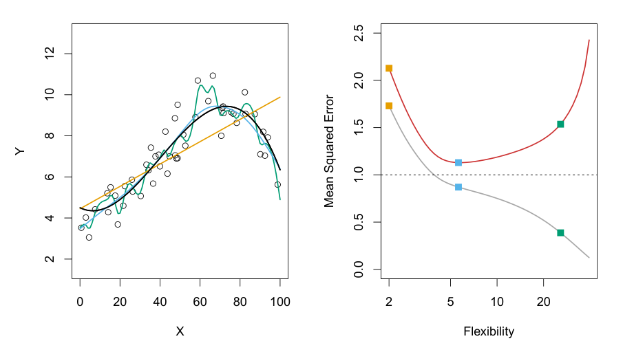
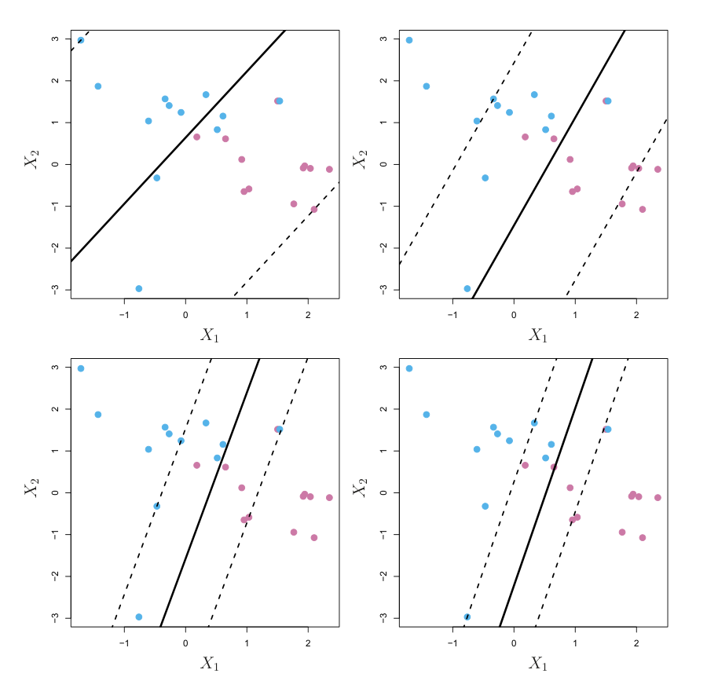

```{r setup, include=FALSE}
knitr::opts_chunk$set(echo = TRUE)
```

## What Is Statistical Learning?


Suppose that we observe a quantitative response $Y$ and $p$
different predictors, $X_1, X_2, \cdots , X_p$. We assume that there is some
relationship between $Y$ and $X = (X_1, X_2, \cdots , X_p)$, which can be written
in the very general form $Y = f(X) + \epsilon$.

Here $f$ is some fixed but unknown function of $X_1, . . . , X_p$, and $\epsilon$ is a random
error term, which is independent of $X$ and has mean zero. In this formulation, $f$ represents the systematic information that $X$ provides about $Y$.

Consider a given estimate $\hat{f}$ and a set of predictors $X$, which yields the
prediction $\hat{Y} = \hat{f}(X)$. Assume for a moment that both $\hat{f}$ and $X$ are fixed,
so that the only variability comes from $\epsilon$. Then, it is easy to show that

$$\begin{aligned}
E(Y-\hat{Y} )^2 = E\left(f(X) + \epsilon - \hat{f}(X) \right)^2 &=\left(f(X) - \hat{f}(X) \right)^2+\text{Var}(\epsilon) \\
&= \underbrace{[f(X) - \hat{f}(X)]^2}_{\text{Reducible}} + \underbrace{\text{Var}(\epsilon)}_{\text{Irreducible}} 
\end{aligned}
$$

where $E(Y - \hat{Y} )^2$ represents the average, or expected value, of the squared expected
value difference between the predicted and actual value of $Y$ , and $\text{Var}(\epsilon)$ 
  represents the variance associated with the error term $\epsilon$.
The focus  is on techniques for estimating $f$ with the aim of
minimizing the reducible error. It is important to keep in mind that the
irreducible error will always provide an upper bound on the accuracy of
our prediction for $Y$ . This bound is almost always unknown in practice.


### The Trade-Off Between Prediction Accuracy and Model Interpretability

One might reasonably ask the following question: why would we ever
choose to use a more restrictive method instead of a very flexible approach?

* If we are mainly interested in inference, then restrictive models are much
more interpretable.


<center>

{width=100%, height=120%}
 <figcaption>A representation of the tradeoff between flexibility and inter-
pretability, using different statistical learning methods. In general, as the flexibility
of a method increases, its interpretability decreases.</figcaption>  
</center>


### The Bias-Variance Trade-Off


<center>
{width=100%, height=120%}
 <figcaption>Left: Data simulated from f, shown in black. Three estimates of
f are shown: the linear regression line (orange curve), and two smoothing spline
fits (blue and green curves). Right: Training MSE (grey curve), test MSE (red
curve), and minimum possible test MSE over all methods (dashed line). Squares
represent the training and test MSEs for the three fits shown in the left-hand
panel.</figcaption>  
</center>


$$E(Y_0 - \hat{f}(X_0))^2 = Var( \hat{f}(X_0)) + \left(\text{Bias}\left( \hat{f}(X_0)\right)\right)^2 + Var(\epsilon).$$

$$\text{Bias}\left( \hat{f}(X_0)\right) = E(\hat{f}(X_0)) - f(X_0)$$

Here the notation 
$E(Y_0 - \hat{f}(X_0))^2$
defines the expected test MSE at $x_0$, expected
test $MSE$
and refers to the average test $MSE$ that we would obtain if we repeatedly
estimated $f$ using a large number of training sets, and tested each at $X_0$. The
overall expected test MSE can be computed by averaging 
$E(Y_0 - \hat{f}(X_0))^2$
over all possible values of $x_0$ in the test set.

The equation tells us that in order to minimize the expected test error,
we need to select a statistical learning method that simultaneously achieves
low variance and low bias. 


What do we mean by the variance and bias of a statistical learning
method? Variance refers to the amount by which $\hat{f}$ would change if we
estimated it using a different training data set. Since the training data
are used to fit the statistical learning method, different training data sets
will result in a different $\hat{f}$. But ideally the estimate for $f$ should not vary
too much between training sets. However, if a method has high variance
then small changes in the training data can result in large changes in $\hat{f}$. In general, more flexible statistical methods exhibit higher variance and lower bias.


<center>
{width=100%, height=120%}
 <figcaption>Squared bias (blue curve), variance (orange curve), Var($\epsilon$)
(dashed line), and test MSE (red curve) for the three data sets in Figures 2.9–2.11.
The vertical dotted line indicates the flexibility level corresponding to the smallest
test MSE.</figcaption>  
</center>


As a general rule, as we use more flexible methods, the variance will
increase and the bias will decrease. The relative rate of change of these
two quantities determines whether the test MSE increases or decreases. As
we increase the flexibility of a class of methods, the bias tends to initially
decrease faster than the variance increases. Consequently, the expected
test MSE declines. However, at some point increasing flexibility has little
impact on the bias but starts to significantly increase the variance. When
this happens the test MSE increases.


The relationship between bias, variance, and mean squared error ($\text{MSE}$) is known as the bias-variance trade-off. Finding a balance between low variance and low squared bias is crucial for optimal model performance. In practical terms, when the true function is unknown, we cannot calculate test $\text{MSE}$, bias, or variance directly, but it's essential to consider the bias-variance trade-off.


As model flexibility increases, the reasons for the decrease in bias and the increase in variance can be attributed to several key factors:

Definition of Bias and Variance:

* Bias refers to the error introduced by overly simplistic assumptions in the model. Less flexible models typically respond simply to the data and have specific assumptions that may overlook complex and nonlinear relationships.

* Variance indicates how much the model's predictions fluctuate in response to minor changes in the training dataset. More flexible models tend to be more sensitive to the data and may react strongly to small changes in the training data.


Decrease in Bias:

* When using a more flexible model (such as decision trees or neural networks), these models can better capture complex and nonlinear patterns in the data. Consequently, they achieve better alignment with the actual data and exhibit lower bias compared to simpler models like linear regression.

Increase in Variance:

* Conversely, flexible models often become closely fitted to the training data, leading to greater variability between training data and new data. This means that if a model "overfits" the training data, its predictive power on new and out-of-sample data may decrease, resulting in higher variance.
Thus, as flexibility increases, while the model can respond to the complexities of relationships and show lower bias, there is also the risk of increased variability, which can lead to poor performance on new data. This relationship between bias and variance forms the basis of the bias-variance trade-off, a key concept in machine learning and statistics.


## Linear Regression

### R-squared

$$\begin{aligned}
R^2=\frac{SSR}{SST}=1-\frac{SSE}{SST}
=1-\frac{\sum \left(y_i-\hat{y_i}\right)^2}{\sum \left(y_i-\bar{y}\right)^2}
=1-\frac{\sum e_i^2}{\sum \left(y_i-\bar{y}\right)^2}
=1-\frac{\text{Unexplained Variation}}{\text{Total variation}}
\end{aligned}.$$

### Adjusted R-squared: 


$$\begin{aligned}
\bar{R}^2=\frac{MSR}{MST}=1-\frac{\frac{SSE}{df_{sse}}}{\frac{SST}{df_{sse}}}
= =1-\frac{\frac{\sum \left(y_i-\hat{y_i}\right)^2}{(n-p)}}{\frac{\sum \left(y_i-\bar{y}\right)^2}{n-1}},
\end{aligned}$$

Where $p=K+1$ and $K$ is the number of independent regressors.


### ANOVA

$$
\begin{array}{ccccccc}
\hline
\text{Source of Variation} & \text{SS} & \text{df} & \text{MS} & F  & \text{Rejection Region} & \text{P-value}  \\
\hline
\text{Regression} & \text{SSR}=\sum \left(\hat{y}_i-\bar{y}\right)^2 & \text{df}=p-1 & \text{MSR} &  F^{*}=\frac{MSR}{MSE} &
F^* > F_{(\alpha,p,n-p)} & P(F_{(\alpha,p,n-p)} \geq F^*)
\\ \text{Residual error} & \text{SSE}=\sum \left(y_i-\hat{y_i}\right)^2 & \text{df}=n-p & \text{MSE} &   & &
\\ \text{Total} & \text{SST}=\sum \left(y_i-\bar{y}\right)^2 & \text{df}=n-1 &  &   & &
\end{array}$$


<center>
{width=50%, height=50%}
</center>

$E(MSE)=\sigma^2$ 

$E(MSR)=\sigma^2 +\beta_1^2 \sum (x_i-\bar{x})^2$

Note that when $\beta_1 = 0$, then $E(MSR) = E(MSE)$, otherwise $E(MSR) > E(MSE)$. A second way
of testing whether $\beta_1 = 0$ is by the F-test:

$$\begin{array}{ccc}
H0 : \beta_1 = 0 \text{ and } HA : \beta_1 \neq 0 \text{ and } \text{Test
Statistic:} F^{*}=\frac{MSR}{MSE}   \text{ and } \text{Rejection Region:} F^* > F_{(\alpha,p,n-p)} & \text{P-value:}P(F_{(\alpha,p,n-p)} \geq F^*)
\end{array}$$

### AIC

Let p be the number of estimated parameters in the model. Let 
$\hat{L}$ be the maximized value of the likelihood function for the model. Then the AIC 
value of the model is the following:


$$\mathrm{AIC} = 2p-2\ln\left(\hat{L}\right)$$


### BIC

The Bayesian information criterion (BIC): defined as:


$$\mathrm{BIC} = p \log n-2\ln\left(\hat{L}\right)$$

<center>
{width=50%, height=50%}
</center>


### Omnibus/Prob(Omnibus)

This function tests the null hypothesis that a sample comes from a normal distribution. It is based on D’Agostino and Pearson’s  test that combines skew and kurtosis to produce an omnibus test of normality.

#### statistic

s^2 + k^2, where s is the z-score returned by skewtest and k is the z-score returned by kurtosistest.

#### pvalue

A 2-sided chi squared probability for the hypothesis test.


### Durbin-Watson

Durbin-Watson tests for homoscedasticity. We hope to have a value between 1 and 2. In statistics, the Durbin–Watson statistic is a test statistic used to detect the presence of autocorrelation at lag 1 in the residuals (prediction errors) from a regression analysis. 

The null hypothesis of the test is that there is no serial correlation in the residuals. The Durbin-Watson test statistic is defined as:

$\frac{\sum \left( e_t - e_{t-1}\right)^2}{\sum e_i^2}$

The test statistic is approximately equal to $2\times(1-r)$ where $r$ is the sample autocorrelation of the residuals. Thus, for $r == 0$, indicating no serial correlation, the test statistic equals $2$. This statistic will always be between 0 and 4. The closer to 0 the statistic, the more evidence for positive serial correlation. The closer to 4, the more evidence for negative serial correlation.


<center>
{width=50%, height=50%}
</center>


### Jarque-Bera (JB)/Prob(JB) The Jarque-Bera test of normality.

Jarque-Bera (JB)/Prob(JB) – like the Omnibus test in that it tests both skew and kurtosis. We hope to see in this test a confirmation of the Omnibus test. In this case we do. 

Each output returned has 1 dimension fewer than data

The Jarque-Bera test statistic tests the null that the data is normally distributed against an alternative that the data follow some other distribution. The test statistic is based on two moments of the data, the skewness, and the kurtosis, and has an asymptotic  distribution.

The test statistic is defined

$$n\left(\frac{s^2}{6}+\frac{(k-3)^2}{24}\right)$$

where n is the number of data points, S is the sample skewness, and K is the sample kurtosis of the data.


### Condition Number

This test measures the sensitivity of a function's output as compared to its input. When we have multicollinearity
, we can expect much higher fluctuations to small changes in the data, hence, we hope to see a relatively small number, something below 30. In this case we are well below 30, which we would expect given our model only has two variables and one is a constant. One way to assess multicollinearity is to compute the condition number. Values over 20 are worrisome (see Greene 4.9). The first step is to normalize the independent variables to have unit length. Then, we take the square root of the ratio of the biggest to the smallest eigen values.


The condition number (abbreviated “Cond. No.” in the summary) is a measure of “how close to singular” a matrix is; the higher, the “more singular” (and infinite means singular — i.e. noninvertible), and the more “error” a best fit approximation is. A condition number of $2.03 \times 10^{17}$ is “practically” infinite, numerically. In truth, it should be infinity.
Warning 2 states that the smallest eigenvalue (of the moment matrix) is $1.02 \times 10^{-21}$, which is “practically” 0. An eigenvalue of $X^T X$ being 0 means the determinant $det(X^T X) = 0$, and so $X^T X$ is not invertible.

The condition number measures how numerically stable the matrix is. A large condition number indicates that the matrix is ill-conditioned. This means that it is sensitive to small changes in its elements and can lead to large changes in the solution when solving linear systems.

#### OLSResults.condition_number

Return condition number of exogenous matrix.

Calculated as ratio of largest to smallest singular value of the exogenous variables. This value is the same as the square root of the ratio of the largest to smallest eigenvalue of the inner-product of the exogenous variables.


## Classification


### The Classification Setting

Suppose that we seek to estimate f on the basis of training observations 
$$\{(x_1, y_1), \cdots , (x_n, y_n)\}$$

where now $y_1, \cdots , y_n$ are qualitative. The
most common approach for quantifying the accuracy of our estimate $\hat{f}$ is
the training error rate, the proportion of mistakes that are made if we apply
our estimate $\hat{f}$ to the training observations:

$$\frac{1}{n} \sum_{i=1}^{n}1_{\{y_i \neq \hat{y}_i\}}$$

Here $\hat{y}_i$ is the predicted class label for the ith observation using $\hat{f}$, And
$1_{\{y_i \neq \hat{y}_i\}}$ is an indicator variable that equals 1 if $y_i \neq \hat{y}_i$ and zero if $y_i \neq \hat{y}_i$. 
If $1_{\{y_i \neq \hat{y}_i\}} = 0$ then the ith observation was classified correctly by our
classification method; otherwise it was misclassified. Hence The Equation 
computes the fraction of incorrect classifications.

### Bayes classifier

The conditional probability assigns each observation to the most likely class,
given its predictor values

$$\text{Pr}(\quad Y = j \quad | \quad X = x_0 \quad)$$


It is the probability that $Y = j$, given the observed predictor vector $x_0$


The Bayes classifier produces the lowest possible test error rate, called
the Bayes error rate.

Since the Bayes classifier will always choose the class Bayes error
rate for which $\text{Pr}(Y = j |  X = x_0 )$ is largest, the error rate will be $1 - \max_j Pr(Y = j|X = x_0)$
at $X = x_0$. In general, the overall Bayes error rate is given by
$$1 - E\left(\max_j Pr(Y = j|X)\right)$$
, where the expectation averages the probability over all possible values of
$X$.


### K-Nearest Neighbors

In theory we would always like to predict qualitative responses using the
Bayes classifier. But for real data, we do not know the conditional distribution of $Y$ given $X$,
and so computing the Bayes classifier is impossible. Many approaches attempt to
estimate the conditional distribution of $Y$ given $X$, and then classify a
given observation to the class with highest estimated probability. One such
method is the $K$-nearest neighbors (KNN) classifier. Given a positive integer
$K$ and a test observation $x_0$, the KNN classifier first identifies the
$K$ points in the training data that are closest to $x_0$, represented by $\mathbf{N}_0$.
It then estimates the conditional probability for class $j$ as the fraction of
points in $\mathbf{N}_0$ whose response values equal j:

$$\text{Pr}(Y = j |  X = x_0 ) = \frac{1}{K} \sum_{y_i\in \mathbf{N}_0} 1_{\{y_i = j\}}$$

Finally, KNN classifies the test observation $x_0$ to the class with the largest
probability from the above conditional probability.


### The Logistic Model


$$\log \left(\frac{p(X)}{1-p(x)}\right) = \beta_0 + \beta_1 X$$


### Generative Models for Classification

Logistic regression involves directly modeling $\text{Pr}(Y = k|X = x)$ using the
logistic function. We now consider an alternative and less direct
approach to estimating these probabilities. In this new approach, we model
the distribution of the predictors $X$ separately in each of the response
classes (i.e. for each value of $Y$ ). We then use Bayes’ theorem to flip these
around into estimates for $\text{Pr}(Y = k|X = x)$.


Let $\pi_k$ represent the overall
or prior probability that a randomly chosen observation comes from the prior
$k$th class. Let $f_k(X) = Pr(X|Y = k)$ denote the density function of $X$
density function for an observation that comes from the $k$th class.

$$\text{Pr}(Y = k |  X = x ) = \frac{\pi_k f_k(x)}{\sum_{l=1}^{K} \pi_l f_l(x)}  $$
This is the posterior probability that an observation posterior
$X = x$ belongs to the $k$th class.

### Linear Discriminant Analysis


The LDA classifier assumes that the
observations in the $k$th class are drawn from a multivariate Gaussian distribution $N(\mu_k, \Sigma)$, where $\mu_k$
is a class-specific mean vector, and $\Sigma$ is a
covariance matrix that is common to all $K$ classes. 

Plugging the density
function for the $k$th class, $f_k(X = x)$, into 
$$\text{Pr}(Y = k |  X = x ) = \frac{\pi_k f_k(x)}{\sum_{l=1}^{K} \pi_l f_l(x)}  $$
and performing a little
bit of algebra reveals that the Bayes classifier assigns an observation $X = x$
to the class for which
$$\delta_k(x) = x^T \Sigma^{-1} \mu_k - \frac{1}{2} \mu_k^T \Sigma^{-1} \mu_k + \log \pi_k$$
is largest.


### Quadratic Discriminant Analysis

Unlike LDA, QDA assumes that each class has its own
covariance matrix. That is, it assumes that an observation from the $k$th
class is of the form $X \sim N(\mu_k, \Sigma_k)$, where $\Sigma_k$ is a covariance matrix for
the $k$th class. Under this assumption, the Bayes classifier assigns an observation $X = x$ to the class for which
$$\delta_k(x) = - \frac{1}{2} (x-\mu_k)^T \Sigma_k^{-1} (x-\mu_k) - \frac{1}{2}\log |\Sigma_k|  +\log \pi_k$$
is largest.


### Naive Bayes

Recall the Bayes’ theorem 
$$\text{Pr}(Y = k |  X = x ) = \frac{\pi_k f_k(x)}{\sum_{l=1}^{K} \pi_l f_l(x)}  $$

provides an expression for the posterior probability $p_k(x) = Pr(Y = k|X = x)$ in terms of $\pi_1, \cdots \pi_K$ and
$f_1(x), \cdots , f_K(x)$.

To use Bayes’ theorem in practice, we need estimates for $\pi_1, \cdots \pi_K$
and $f_1(x), \cdots , f_K(x)$. Estimating the prior
probabilities $\pi_1, \cdots \pi_K$ is typically straightforward: for instance, we can
estimate $\pi_k$ as the proportion of training observations belonging to the $k$th
class, for $k = 1, \cdots , K$.

However, estimating $f_1(x), \cdots , f_K(x)$ is more subtle. Recall that $f_k(x)$
is the p-dimensional density function for an observation in the $k$th class,
for $k = 1, \cdots , K$.


The naive Bayes classifier takes a different tack for estimating $f_1(x), \cdots , f_K(x)$. Instead of assuming that these functions belong to a particular
family of distributions (e.g. multivariate normal), we instead make a single
assumption:

$$\text{Within the kth class, the p predictors are independent.}$$
Stated mathematically, this assumption means that for $k = 1, \cdots , K$,
$f_k(x) = f_{k1}(x_1) \times f_{k2}(x_2) \times \cdots \times f_{kp}(x_p)$,

where $f_{kj}$ is the density function of the $j$th predictor among observations
in the $k$th class.

$$\text{Pr}(Y = k |  X = x ) = \frac{\pi_k f_{k1}(x_1) \times f_{k2}(x_2) \times \cdots \times f_{kp}(x_p)}{\sum_{l=1}^{K} \pi_l f_{l1}(x_1) \times f_{l2}(x_2) \times \cdots \times f_{lp}(x_p)}  $$

## Tree-Based Methods

### Decision Trees


#### Regression Trees

We now discuss the process of building a regression tree. Roughly speaking,
there are two steps.

* We divide the predictor space — that is, the set of possible values
for $X_1, X_2, \cdots , X_p$ — into $J$ distinct and non-overlapping regions,
$R_1, R_2, . . . , R_J$.

* For every observation that falls into the region $R_j$, we make the same
prediction, which is simply the mean of the response values for the
training observations in $R_j$.


We now elaborate on Step 1 above. How do we construct the regions
$R_1, R_2, . . . , R_J$?


In theory, the regions could have any shape. However, we
choose to divide the predictor space into high-dimensional rectangles, or
boxes, for simplicity and for ease of interpretation of the resulting predictive model.
The goal is to find boxes $R_1, R_2, . . . , R_J$ that minimize the $RSS$,
given by
$$\sum_{j=1}^{J} \sum_{y_i \in R_j}(y_i - \hat{y}_{R_j})^2$$

where $\hat{y}_{R_j}$ is the mean response for the training observations within the
$j$th box. Unfortunately, it is computationally infeasible to consider every
possible partition of the feature space into $J$ boxes.

For this reason, we take
a top-down, greedy approach that is known as recursive binary splitting. The recursive
binary splitting approach is top-down because it begins at the top of the tree (at which point
all observations belong to a single region) and then successively splits the
predictor space; each split is indicated via two new branches further down
on the tree. It is greedy because at each step of the tree-building process,
the best split is made at that particular step, rather than looking ahead
and picking a split that will lead to a better tree in some future step.

In order to perform recursive binary splitting, we first select the predictor $Xj$ and the cutpoint $s$ such that splitting the predictor space into
the regions $\{X|Xj < s\}$ and $\{X|Xj \geq s\}$ leads to the greatest possible
reduction in RSS. (The notation $\{X|Xj < s\}$ means the region of predictor
space in which $X_j$ takes on a value less than $s$.) That is, we consider all
predictors $X_1, \cdots , X_p$, and all possible values of the cutpoint $s$ for each of
the predictors, and then choose the predictor and cutpoint such that the
resulting tree has the lowest RSS. In greater detail, for any $j$ and $s$, we
define the pair of half-planes
$R_1(j, s) = \{X|Xj < s\}$ and $R2(j, s) = \{X|Xj \geq s\}$,
and we seek the value of $j$ and $s$ that minimize the equation
$$ \sum_{i:x_i \in R_1(j, s)}(y_i - \hat{y}_{R_1})^2 + \sum_{i:x_i \in R_2(j, s)}(y_i - \hat{y}_{R_2})^2$$
where $\hat{y}_{R_1}$ is the mean response for the training observations in $R_1(j, s)$,
and $\hat{y}_{R_2}$ is the mean response for the training observations in $R_2(j, s)$.
Finding the values of $j$ and $s$ that minimize th above equation can be done quite quickly,
especially when the number of features $p$ is not too large.

Next, we repeat the process, looking for the best predictor and best
cutpoint in order to split the data further so as to minimize the RSS within each of the resulting regions.

<center>

{width=100%, height=120%}
 <figcaption>Top Left: A partition of two-dimensional feature space that could
not result from recursive binary splitting. Top Right: The output of recursive
binary splitting on a two-dimensional example. Bottom Left: A tree corresponding
to the partition in the top right panel. Bottom Right: A perspective plot of the
prediction surface corresponding to that tree.</figcaption>  
</center>

However, this time, instead of splitting the
entire predictor space, we split one of the two previously identified regions.
We now have three regions. Again, we look to split one of these three regions
further, so as to minimize the RSS. The process continues until a stopping
criterion is reached; for instance, we may continue until no region contains
more than five observations.
Once the regions $R_1, R_2, \cdots , R_J$ have been created, we predict the response
for a given test observation using the mean of the training observations in
the region to which that test observation belongs.

#### Tree Pruning

The process described above may produce good predictions on the training
set, but is likely to overfit the data, leading to poor test set performance.
This is because the resulting tree might be too complex. A smaller tree
with fewer splits (that is, fewer regions $R_1, R_2, \cdots , R_J$) might lead to lower
variance and better interpretation at the cost of a little bias. One possible
alternative to the process described above is to build the tree only so long
as the decrease in the RSS due to each split exceeds some (high) threshold.
This strategy will result in smaller trees, but is too short-sighted since a
seemingly worthless split early on in the tree might be followed by a very
good split—that is, a split that leads to a large reduction in RSS later on.


Therefore, a better strategy is to grow a very large tree T0, and then
prune it back in order to obtain a subtree. How do we determine the best prune
subtree way to prune the tree? Intuitively, our goal is to select a subtree that
leads to the lowest test error rate. Given a subtree, we can estimate its
test error using cross-validation or the validation set approach. However,
estimating the cross-validation error for every possible subtree would be too
cumbersome, since there is an extremely large number of possible subtrees.
Instead, we need a way to select a small set of subtrees for consideration.


Cost complexity pruning—also known as weakest link pruning-gives us 
a way to do just this. Rather than considering every possible subtree, we
consider a sequence of trees indexed by a nonnegative tuning parameter $\alpha$.
For each value of $\alpha$ there corresponds a subtree $T \subset T_0$ such that

$$C_\alpha(T)=\sum_{m=1}^{|T|} \underbrace{\sum_{\{i:x_i \in R_m\}} (y_i-\hat{y}_{R_m})^2}_{N_m Q_m(T)}+ \alpha |T| =\sum_{m=1}^{|T|} N_m Q_m(T)+ \alpha |T|$$
is as small as possible, where 
$$N_m = \quad \#\{i:xi \in R_m\}$$

<center>

{width=40%, height=40%}

</center>


#### Classification Trees


We now turn to the question of how to grow a regression tree. Our data
consists of $p$ inputs and a response, for each of $N$ observations: that is,
$(x_i, y_i)$ for $i = 1, 2, \cdots , N$, with $x_i = (x_{i1}, x_{i2}, . . . , x_{ip})$. 
Suppose first that we
have a partition into $M$ regions $R_1, R_2, \cdots , R_M$

We define a subtree $T \subset T_0$ to be any tree that can be obtained by
pruning $T_0$, that is, collapsing any number of its internal (non-terminal)
nodes. We index terminal nodes by $m$, with node $m$ representing region
$R_m$. Let $|T|$ denote the number of terminal nodes in $T$. Letting

$$N_m = \#\{xi \in R_m\}$$


In a node $m$, representing a region $R_m$ with $N_m$ observations,
let
$$\hat{p}_{m,k} = \frac{1}{Nm} \sum_{x_i \in R_m}1_{\{y_i=k\}}$$
, the proportion of class $k$ observations in node $m$.
We classify the observations in node $m$ to class $k(m) = \arg \max_k \hat{p}(m,k)$, the majority class in
node m.

$$C_\alpha(T)=\sum_{m=1}^{|T|} N_m Q_m(T)+ \alpha |T|$$


Different measures $Q_m(T)$ of node impurity include the following:

$$\begin{aligned}
\text{Misclassification error} &:
\frac{1}{N_m} \sum_{i\in R_m} I(y_i \neq k(m)) =1- \hat{p}_{m,k(m)}
\\
\text{Gini index} &:\sum_{k \neq k^{\prime}} \hat{p}_{m,k} \hat{p}_{m,k^{\prime}} = \sum_{k=1}^{K}\hat{p}_{m,k}(1-\hat{p}_{m,k})
\\
\text{Cross-entropy or deviance} &: -\sum_{k=1}^{K}\hat{p}_{m,k} \log \hat{p}_{m,k}
\end{aligned}$$


### Bagging (Bootstrap aggregation / weak learners)


An ensemble method is an approach that combines many simple “building block” models in order to obtain a single and potentially very powerful
model. These simple building block models are sometimes known as weak
learners, since they may lead to mediocre predictions on their own.


Bootstrap aggregation, or bagging, is a general-purpose procedure for reducing the bagging
variance of a statistical learning method; we introduce it here because it is
particularly useful and frequently used in the context of decision trees.
Recall that given a set of n independent observations $Z_1, . . . , Z_n$, each
with variance $\sigma^2$, the variance of the mean $\bar{Z}$ of the observations is given
by $\frac{\sigma^2}{n}$. In other words, averaging a set of observations reduces variance.
Hence a natural way to reduce the variance and increase the test set accuracy of a statistical learning method is to take many training sets from
the population, build a separate prediction model using each training set,
and average the resulting predictions. In other words, we could calculate
$\hat{f}^1(x), \hat{f}^2(x), \cdots , \hat{f}^B(x)$ using $B$ separate training sets, and average them
in order to obtain a single low-variance statistical learning model, given by
$$\hat{f}(x) = \frac{1}{B} \sum_{b=1}^B \hat{f}^b(x).$$

Of course, this is not practical because we generally do not have access
to multiple training sets. Instead, we can bootstrap, by taking repeated
samples from the (single) training data set. This is called bagging.


#### Variable Importance Measures


s we have discussed, bagging typically results in improved accuracy over
prediction using a single tree. Unfortunately, however, it can be difficult to
interpret the resulting model. Recall that one of the advantages of decision
trees is the attractive and easily interpreted diagram that results. However, when we bag a large number of
trees, it is no longer possible to represent the resulting statistical learning
procedure using a single tree, and it is no longer clear which variables
are most important to the procedure. Thus, bagging improves prediction
accuracy at the expense of interpretability.

Although the collection of bagged trees is much more difficult to interpret
than a single tree, one can obtain an overall summary of the importance of
each predictor using the RSS (for bagging regression trees) or the Gini index
(for bagging classification trees). In the case of bagging regression trees, we
can record the total amount that the RSS  is decreased due to splits
over a given predictor, averaged over all B trees. A large value indicates
an important predictor. Similarly, in the context of bagging classification
trees, we can add up the total amount that the Gini index (8.6) is decreased
by splits over a given predictor, averaged over all B trees.


### Random Forests

Random forests provide an improvement over bagged trees by way of a random
forest
small tweak that decorrelates the trees. As in bagging, we build a number
of decision trees on bootstrapped training samples. But when building these
decision trees, each time a split in a tree is considered, a random sample of
$m$ predictors is chosen as split candidates from the full set of $p$ predictors.
The split is allowed to use only one of those $m$ predictors. A fresh sample of
$m$ predictors is taken at each split, and typically we choose $m = \sqrt(p)$-that
is, the number of predictors considered at each split is approximately equal
to the square root of the total number of predictors (4 out of the 13).


In other words, in building a random forest, at each split in the tree,
the algorithm is not even allowed to consider a majority of the available
predictors. This may sound crazy, but it has a clever rationale. Suppose
that there is one very strong predictor in the data set, along with a number of other moderately strong predictors. Then in the collection of bagged
trees, most or all of the trees will use this strong predictor in the top split.
Consequently, all of the bagged trees will look quite similar to each other.
Hence the predictions from the bagged trees will be highly correlated. Unfortunately, averaging many highly correlated quantities does not lead to
as large of a reduction in variance as averaging many uncorrelated quantities. In particular, this means that bagging will not lead to a substantial
reduction in variance over a single tree in this setting.

Random forests overcome this problem by forcing each split to consider
only a subset of the predictors. Therefore, on average $\frac{p - m}{p}$ of the
splits will not even consider the strong predictor, and so other predictors
will have more of a chance. We can think of this process as decorrelating
the trees, thereby making the average of the resulting trees less variable
and hence more reliable.

The main difference between bagging and random forests is the choice
of predictor subset size m. For instance, if a random forest is built using
$m = p$, then this amounts simply to bagging.

Using a small value of $m$ in building a random forest will typically be
helpful when we have a large number of correlated predictors. 

We randomly divided the observations into a training and a test set, and
applied random forests to the training set for three different values of the
number of splitting variables $m$.

### Boosting

Like bagging, boosting is a general
approach that can be applied to many statistical learning methods for regression or classification.
Recall that bagging involves creating multiple copies of the original training data set using the bootstrap, fitting a separate decision tree to each copy, and then combining all of the trees in order to create a single predictive model. Notably, each tree is built on a bootstrap data set, independent
of the other trees. Boosting works in a similar way, except that the trees are
grown sequentially: each tree is grown using information from previously
grown trees. Boosting does not involve bootstrap sampling; instead each
tree is fit on a modified version of the original data set.


<center>

{width=40%, height=40%}

</center>

Boosting has three tuning parameters:


1. The number of trees $B$. Unlike bagging and random forests, boosting
can overfit if $B$ is too large, although this overfitting tends to occur
slowly if at all. We use cross-validation to select $B$.

2. The shrinkage parameter $\lambda$, a small positive number. This controls
the rate at which boosting learns. Typical values are 0.01 or 0.001, and
the right choice can depend on the problem. Very small $\lambda$ can require
using a very large value of $B$ in order to achieve good performance.

3. The number d of splits in each tree, which controls the complexity
of the boosted ensemble. Often $d = 1$ works well, in which case each
tree is a stump, consisting of a single split. In this case, the boosted 
ensemble is fitting an additive model, since each term involves only a
single variable. More generally $d$ is the interaction depth, and controls 
the interaction order of the boosted model, since d splits can involve
at most $d$ variables.


<center>

{width=30%, height=30%}
 <figcaption>Results from performing boosting and random forests on the
15-class gene expression data set in order to predict cancer versus normal. The test
error is displayed as a function of the number of trees. For the two boosted models,
$\lambda = 0.01$. Depth-1 trees slightly outperform depth-2 trees, and both outperform
the random forest, although the standard errors are around $0.02$, making none of
these differences significant. The test error rate for a single tree is $24\%$.</figcaption>  
</center>


### Bayesian Additive Regression Trees (BART)


Recall that bagging and random forests make predictions from an average of regression trees, each of which is built using a random sample of data
and/or predictors. Each tree is built separately from the others. By contrast, boosting uses a weighted sum of trees, each of which is constructed
by fitting a tree to the residual of the current fit. Thus, each new tree attempts to capture signal that is not yet accounted for by the current set
of trees. BART is related to both approaches: each tree is constructed in
a random manner as in bagging and random forests, and each tree tries to
capture signal not yet accounted for by the current model, as in boosting.
The main novelty in BART is the way in which new trees are generated.

We let $K$ denote the number of regression trees, and $B$ the number of iterations
for which the BART algorithm will be run. The notation 
$\hat{f}^b_k(x)$
represents
the prediction at $x$ for the $k$th regression tree used in the $b$th iteration. At
the end of each iteration, the $K$ trees from that iteration will be summed,
i.e 
$$\hat{f}^b(x) = \sum_{k=1}^{K} \hat{f}^b_k(x), \quad \text{for} b=1,\cdots ,B$$
In the first iteration of the BART algorithm, all trees are initialized to
have a single root node, with 

$$\hat{f}^1_k(x) =\frac{1}{nK} \sum_{i=1}^n y_i$$
,the mean of the response values divided by the total number of trees. Thus,

$$\hat{f}^1(x) = \sum_{k=1}^K \hat{f}^1_k(x)= \frac{1}{n} \sum_{i=1}^n y_i$$
In subsequent iterations, BART updates each of the $K$ trees, one at a
time. In the $b$th iteration, to update the $k$th tree, we subtract from each
response value the predictions from all but the $k$th tree, in order to obtain
a partial residual

$$r_i = y_i - \sum_{k^{\prime}\neq k} \hat{f}^1_{k^{^{\prime}}}(x)=
y_i - \sum_{k^{\prime} < k} \hat{f}^1_{k^{^{\prime}}}(x) - \sum_{k^{\prime} > k} \hat{f}^1_{k^{^{\prime}}}(x)$$


for the ith observation, $i = 1, \cdots , n$. Rather than fitting a fresh tree to this
partial residual, BART randomly chooses a perturbation to the tree from
the previous iteration ($\hat{f}^{b-1}_k$) from a set of possible perturbations, favoring
ones that improve the fit to the partial residual. There are two components
to this perturbation:

1. We may change the structure of the tree by adding or pruning branches.

2. We may change the prediction in each terminal node of the tree.

The output of BART is a collection of prediction models,

$$\hat{f}^b(x) = \sum_{k=1}^K \hat{f}^b_k(x), \quad \text{for} b=1,\cdots B.$$


<center>

{width=60%, height=60%}
 <figcaption>A schematic of perturbed trees from the BART algorithm. (a):
The $k$th tree at the $(b - 1)$st iteration, $\hat{f}^{b-1}_k(x)$, is displayed. Panels (b)-(d)
display three of many possibilities for $\hat{f}^{b}_k(x)$, given the form of $\hat{f}^{b-1}_k(x)$. (b): One
possibility is that $\hat{f}^{b}_k(x)$ has the same structure as $\hat{f}^{b-1}_k(x)$, but with different
predictions at the terminal nodes. (c): Another possibility is that $\hat{f}^{b}_k(x)$ results
from pruning $\hat{f}^{b-1}_k(x)$. (d): Alternatively, $\hat{f}^{b}_k(x)$ may have more terminal nodes
than $\hat{f}^{b-1}_k(x)$.</figcaption>  
</center>

<center>

{width=50%, height=50%}
  
</center>

We typically throw away the first few of these prediction models, since
models obtained in the earlier iterations, known as the burn-in period, tend not to provide very good results.
We can let $L$ denote the number of burn-in iterations; for instance, we might take $L = 200$. Then, to
obtain a single prediction, we simply take the average after the burn-in
iterations,

$$\hat{f}(x) =\frac{1}{B-L} \sum_{b=L+1}^B \hat{f}^b(x).$$
However, it is also possible to compute quantities other than the average: for instance, the percentiles of
$\hat{f}^{L+1}(x), \cdots \hat{f}^B(x)$ provide a measure of uncertainty in the final prediction.

A key element of the BART approach is that in Step 3(a)ii., we do not fit
a fresh tree to the current partial residual: instead, we try to improve the fit
to the current partial residual by slightly modifying the tree obtained in the
previous iteration (see Figure 8.12). Roughly speaking, this guards against
overfitting since it limits how “hard” we fit the data in each iteration.
Furthermore, the individual trees are typically quite small. We limit the
tree size in order to avoid overfitting the data, which would be more likely
to occur if we grew very large trees.


<center>

{width=60%, height=60%}
 <figcaption>BART and boosting results for the Heart data. Both training
and test errors are displayed. After a burn-in period of 100 iterations (shown in
gray), the error rates for BART settle down. Boosting begins to overfit after a
few hundred iterations.</figcaption>  
</center>

Though the details are outside of the scope of this book, it turns out
that the BART method can be viewed as a Bayesian approach to fitting an
ensemble of trees: each time we randomly perturb a tree in order to fit the
residuals, we are in fact drawing a new tree from a posterior distribution.
(Of course, this Bayesian connection is the motivation for BART’s name.)

#### Summary of Tree Ensemble Methods

Trees are an attractive choice of weak learner for an ensemble method
for a number of reasons, including their flexibility and ability to handle
predictors of mixed types (i.e. qualitative as well as quantitative). We have
now seen four approaches for fitting an ensemble of trees: bagging, random
forests, boosting, and BART.

• In bagging, the trees are grown independently on random samples of
the observations. Consequently, the trees tend to be quite similar to
each other. Thus, bagging can get caught in local optima and can fail
to thoroughly explore the model space.

• In random forests, the trees are once again grown independently on
random samples of the observations. However, each split on each tree
is performed using a random subset of the features, thereby decorrelating the trees, and leading to a more thorough exploration of model
space relative to bagging.

• In boosting, we only use the original data, and do not draw any random samples. The trees are grown successively, using a “slow” learning approach: each new tree is fit to the signal that is left over from
the earlier trees, and shrunken down before it is used.

• In BART, we once again only make use of the original data, and we
grow the trees successively. However, each tree is perturbed in order
to avoid local minima and achieve a more thorough exploration of
the model space.


## Support Vector Machines


### Maximal Margin Classifier

#### What Is a Hyperplane?

In a $p$-dimensional space, a hyperplane is a flat affine subspace of 
dimension $p-1$. For instance, in two dimensions, a hyperplane is a flat
one-dimensional subspace,--in other words, a line. In three dimensions, a
hyperplane is a flat two-dimensional subspace--, that is, a plane. In $p > 3$
dimensions, it can be hard to visualize a hyperplane, but the notion of a
$(p-1)$-dimensional flat subspace still applies.
The mathematical definition of a hyperplane is quite simple. In two dimensions, a hyperplane is defined by the equation

$$\beta_0 + \beta_1 X_1 + \beta_2 X_2 = 0 \quad \quad \quad (9.1)$$
for parameters $\beta_0$, $\beta_1$, and $\beta_2$.

When we say that (9.1) “defines” the hyper-plane, we mean that any $X = (X_1, X_2)^T$ for which (9.1) holds is a point
on the hyperplane. Note that (9.1) is simply the equation of a line, since
indeed in two dimensions a hyperplane is a line.


Equation (9.1) can be easily extended to the $p$-dimensional setting:
$$\beta_0 + \beta_1X_1 + \beta_2X_2 + \cdots + \beta_pX_p = 0 \quad \quad \quad (9.2)$$
defines a $p$-dimensional hyperplane, again in the sense that if a point 
$X = (X_1, X_2, \cdots , X_p)^T$ in p-dimensional space (i.e. a vector of length $p$) satisfies
(9.2), then X lies on the hyperplane.

Now, suppose that $X$ does not satisfy (9.2); rather,
$$\beta_0 + \beta_1X_1 + \beta_2X_2 + \cdots + \beta_pX_p > 0 \quad \quad \quad (9.3)$$
Then this tells us that $X$ lies to one side of the hyperplane. On the other
hand, if

$$\beta_0 + \beta_1X_1 + \beta_2X_2 + \cdots + \beta_pX_p < 0 \quad \quad \quad (9.4)$$

then $X$ lies on the other side of the hyperplane. So we can think of the
hyperplane as dividing $p$-dimensional space into two halves. One can easily
determine on which side of the hyperplane a point lies by simply calculating
the sign of the left-hand side of (9.2).


#### Classification Using a Separating Hyperplane


We can label the observations $y_i = 1$ and
 $y_i = -1$. Then a separating hyperplane has
the property that

$$\beta_0 + \beta_1X_1 + \beta_2X_2 + \cdots + \beta_pX_p > 0 \quad \quad \quad Y=1$$
and

$$\beta_0 + \beta_1X_1 + \beta_2X_2 + \cdots + \beta_pX_p < 0 \quad \quad \quad Y=-1$$
Equivalently, a separating hyperplane has the property that

$$Y\left(\beta_0 + \beta_1X_1 + \beta_2X_2 + \cdots + \beta_pX_p\right) > 0 $$
If a separating hyperplane exists, we can use it to construct a very natural
classifier: a test observation is assigned a class depending on which side of
the hyperplane it is located.  That is, we classify the test observation $x^*$
based on the sign of

$$f(x^*) =\left(\beta_0 + \beta_1X_1^* + \beta_2X_2^* + \cdots + \beta_pX_p^*\right)$$
If $f(x^*)$ is positive,
then we assign the test observation to class 1, and if $f(x^*)$ is negative, then
we assign it to class -1. We can also make use of the magnitude of$f(x^*)$. If
$f(x^*)$ is far from zero, then this means that $x^*$ lies far from the hyperplane,
and so we can be confident about our class assignment for $x^*$. On the other
hand, if $f(x^*)$ is close to zero, then $x^*$ is located near the hyperplane, and so
we are less certain about the class assignment for $x^*$.

#### The Maximal Margin Classifier (optimal separating hyperplane)

In general, if our data can be perfectly separated using a hyperplane, then
there will in fact exist an infinite number of such hyperplanes. This is
because a given separating hyperplane can usually be shifted a tiny bit up or
down, or rotated, without coming into contact with any of the observations.


<center>

{width=60%, height=60%}
 <figcaption>Left: There are two classes of observations, shown in blue and
in purple, each of which has measurements on two variables. Three separating
hyperplanes, out of many possible, are shown in black. Right: A separating hyperplane is shown in black. The blue and purple grid indicates the decision rule
made by a classifier based on this separating hyperplane: a test observation that
falls in the blue portion of the grid will be assigned to the blue class, and a test
observation that falls into the purple portion of the grid will be assigned to the
purple class.</figcaption>  
</center>

In order to construct a classifier based upon a separating
hyperplane, we must have a reasonable way to decide which of the infinite
possible separating hyperplanes to use.

A natural choice is the maximal margin hyperplane (also known as 
optimal separating hyperplane), which is the separating hyperplane that
is farthest from the training observations. That is, we can compute the
(perpendicular) distance from each training observation to a given separating hyperplane; the smallest such distance is the minimal distance from the
observations to the hyperplane, and is known as the margin. The maximal
margin hyperplane is the separating hyperplane for which the margin is
largest-that is, it is the hyperplane that has the farthest minimum distance to the training observations. We can then classify a test observation
based on which side of the maximal margin hyperplane it lies. This is known
as the maximal margin classifier.

If $\beta_0,\cdots, \beta_p$ are the coefficients of the maximal margin hyperplane,
then the maximal margin classifier classifies the test observation $x^*$ based
on the sign of 
$$f(x^*) =\left(\beta_0 + \beta_1X_1^* + \beta_2X_2^* + \cdots + \beta_pX_p^*\right)$$


#### Construction of the Maximal Margin Classifier

We now consider the task of constructing the maximal margin hyperplane
based on a set of n training observations $x_1, \cdots , x_n \in \mathbf{R}^p$  and associated
class labels $y_1, \cdots , y_n \in \{-1, 1\}$. Briefly, the maximal margin hyperplane
is the solution to the optimization problem

\begin{eqnarray}
&\stackrel{\max M}{\beta_0,\cdots, \beta_p, M}& \\
\sum_{j=1}^p \beta_i^2 &=& 1 \\
y_i(\beta_b + \beta_1 x_{i,1} + \cdots +\beta_p x_{ip}) \geq  &M& \quad  \text{for } i=1,\cdots, n
\end{eqnarray}


#### The Non-separable Case


The maximal margin classifier is a very natural way to perform classification, if a separating hyperplane exists. However, as we have hinted, in
many cases no separating hyperplane exists, and so there is no maximal margin classifier.


<center>

{width=60%, height=60%}
 <figcaption>There are two classes of observations, shown in blue and in
purple. In this case, the two classes are not separable by a hyperplane, and so the
maximal margin classifier cannot be used.</figcaption>  
</center>


We can extend the concept of a separating hyperplane in order to
develop a hyperplane that almost separates the classes, using a so-called
soft margin. The generalization of the maximal margin classifier to the
non-separable case is known as the support vector classifier.


### Support Vector Classifiers


The support vector classifier classifies a test observation depending on
which side of a hyperplane it lies. The hyperplane is chosen to correctly
separate most of the training observations into the two classes, but may
misclassify a few observations. It is the solution to the optimization problem

\begin{eqnarray}
\stackrel{\max M}{\beta_0,\cdots, \beta_p,\epsilon_1,\cdots, \epsilon_n, M} \\
\sum_{j=1}^p \beta_i^2 = 1 \\
y_i(\beta_0 + \beta_1 x_{i,1} + \cdots +\beta_p x_{ip}) \geq  M(1-\epsilon_i) \quad  \text{for } i=1,\cdots, n \\
\epsilon_i \geq 0, \quad \sum_{i=1}^n \epsilon_i \leq C
\end{eqnarray}
where $C$ is a nonnegative tuning parameter. $M$ is the width
of the margin; we seek to make this quantity as large as possible. 
$\epsilon_1,\cdots, \epsilon_n$ are slack variables that allow individual observations to be on slack
variable the wrong side of the margin or the hyperplane.

$C$ bounds determines the number and severity of the violations to the margin (and to the hyperplane) that we will tolerate. We can
think of $C$ as a budget for the amount that the margin can be violated
by the $n$ observations.

<center>

{width=60%, height=60%}
 <figcaption>A support vector classifier was fit using four different values
of the tuning parameter C. The largest value of C was used
in the top left panel, and smaller values were used in the top right, bottom left,
and bottom right panels. When C is large, then there is a high tolerance for
observations being on the wrong side of the margin, and so the margin will be
large. As C decreases, the tolerance for observations being on the wrong side of
the margin decreases, and the margin narrows.</figcaption>  
</center>

### Support Vector Machines

The support vector classifier is a natural approach for classification in the
two-class setting, if the boundary between the two classes is linear. How-
ever, in practice we are sometimes faced with non-linear class boundaries.

The support vector machine (SVM) is an extension of the support vector 
classifier that results from enlarging the feature space in a specific way,
using kernels.

The inner product of two $r$-vectors $a$ and $b$ is
defined as 
$\left<a,b\right> = \sum_{i=1}^r a_i b_i$
Thus the inner product of two observations
$x_i$, $x_{i^\prime}$ is given by

$$\left<x_i,x_{i^\prime}\right> = \sum_{j=1}^p x_{ij} x_{i^{\prime} j}$$
It can be shown that

The linear support vector classifier can be represented as

$$f(x) = \beta_0 + \sum_{i=1}^n \alpha_i\left<x,x_i\right>$$
$$x = (x_1, x_2, \ldots, x_p)$$
$$x_i = (x_{i,1}, x_{i,2}, \ldots, x_{i,p})$$
$$f(x) = \beta_0 + \sum_{i=1}^n \alpha_i\left<x,x_i\right> = \beta_0 + \sum_{i=1}^n \alpha_i \sum_{j=1}^p x_j x_{ij} =\beta_0 + \sum_{j=1}^p x_j \left(\sum_{i=1}^n \alpha_i  x_{ij}\right)$$


We replace it with a generalization of the inner product of
the form $K(x_i,x_{i^\prime})$
where $K$ is some function that we will refer to as a kernel. A kernel is a kernel
function that quantifies the similarity of two observations. For instance, we
could simply take
$$\sum_{i=1}^n \left<x_{ij},x_{i^\prime j}\right>$$
which would just give us back the support vector classifier.

$$f(x) = \beta_0 + \sum_{i\in S}^n \alpha_i K(x,x_i)$$

\begin{eqnarray}
\text{dth-Degree polynomial:} k(x, x^\prime) = (1 + \left<x, x^\prime\right>)^d,
\text{Radial basis:} k(x, x^\prime) = exp(-Y|| - x^\prime||),
\text{Neural network:} k(x, x^\prime) = \tanh(\kappa_1\left<x, x^\prime\right> + \kappa_2)
\end{eqnarray}

### SVMs with More than Two Classes

So far, our discussion has been limited to the case of binary classification:
that is, classification in the two-class setting. How can we extend SVMs
to the more general case where we have some arbitrary number of classes?
It turns out that the concept of separating hyperplanes upon which SVMs
are based does not lend itself naturally to more than two classes. Though
a number of proposals for extending SVMs to the K-class case have been
made, the two most popular are the one-versus-one and one-versus-all
approaches. We briefly discuss those two approaches here.


#### One-Versus-One Classification


Suppose that we would like to perform classification using SVMs, and there
are $K > 2$ classes. A one-versus-one or all-pairs approach constructs
$\binom{K}{2}$
SVMs, each of which compares a pair of classes. For example, one such
SVM might compare the $k$th class, coded as +1, to the $k^\prime$th class, coded
as -1. We classify a test observation using each of the
$\binom{K}{2}$
classifiers, and
we tally the number of times that the test observation is assigned to each
of the $K$ classes. The final classification is performed by assigning the test
observation to the class to which it was most frequently assigned in these
$\binom{k}{2}$
pairwise classifications.


#### One-Versus-All (one-versus-rest)Classification
The one-versus-all approach (also referred to as one-versus-rest) is an alternative procedure for applying SVMs in the case of $K > 2$ classes. We
fit $K$ SVMs, each time comparing one of the $K$ classes to the remaining
$K-1$ classes. Let $\beta_{0k}, \beta_{1k}, \cdots , \beta_{pk}$ denote the parameters that result from
fitting an SVM comparing the $k$th class (coded as +1) to the others (coded
as -1). Let $x^*$ denote a test observation. We assign the observation to the
class for which $\beta_{0k} + \beta_{1k}x^*_1 + \cdots , \beta_{pk}x^*_p$
 is largest, as this amounts
to a high level of confidence that the test observation belongs to the $k$th
class rather than to any of the other classes.
